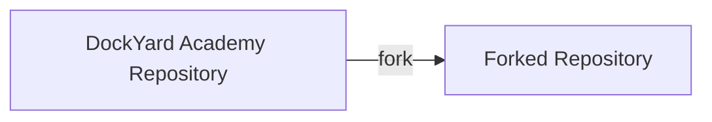
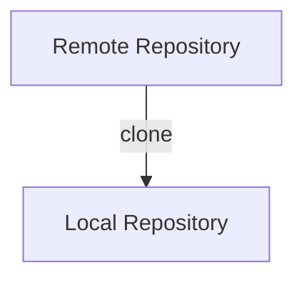
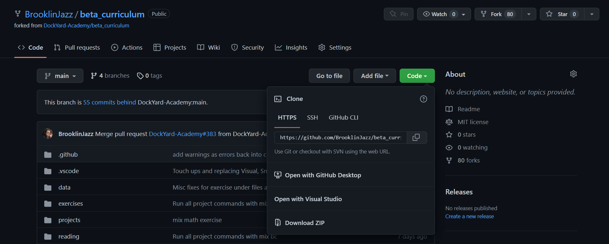
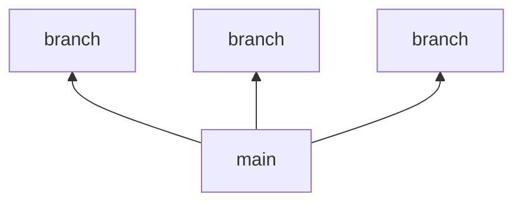
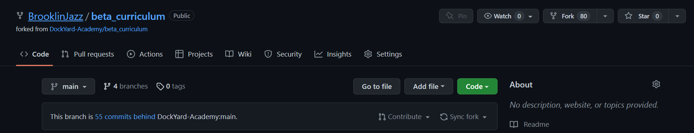
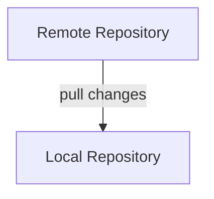
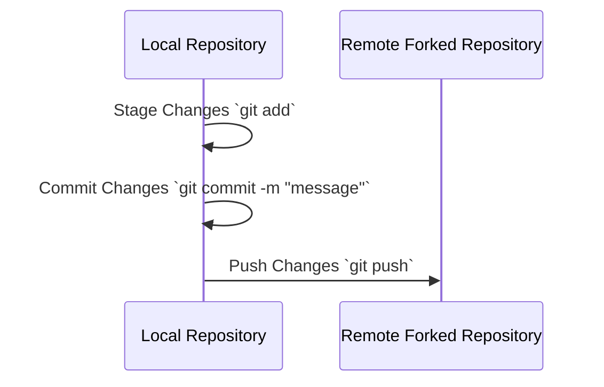
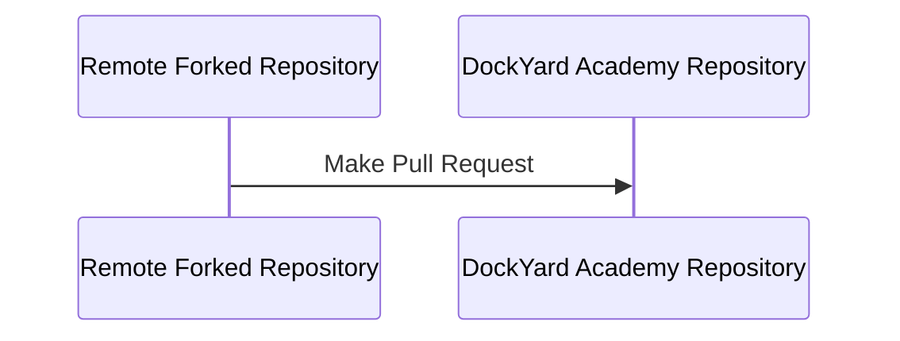
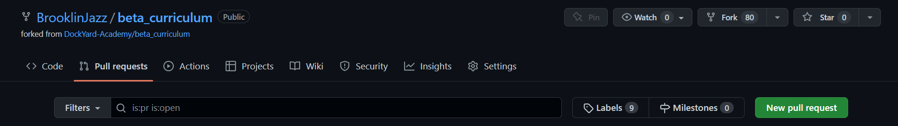
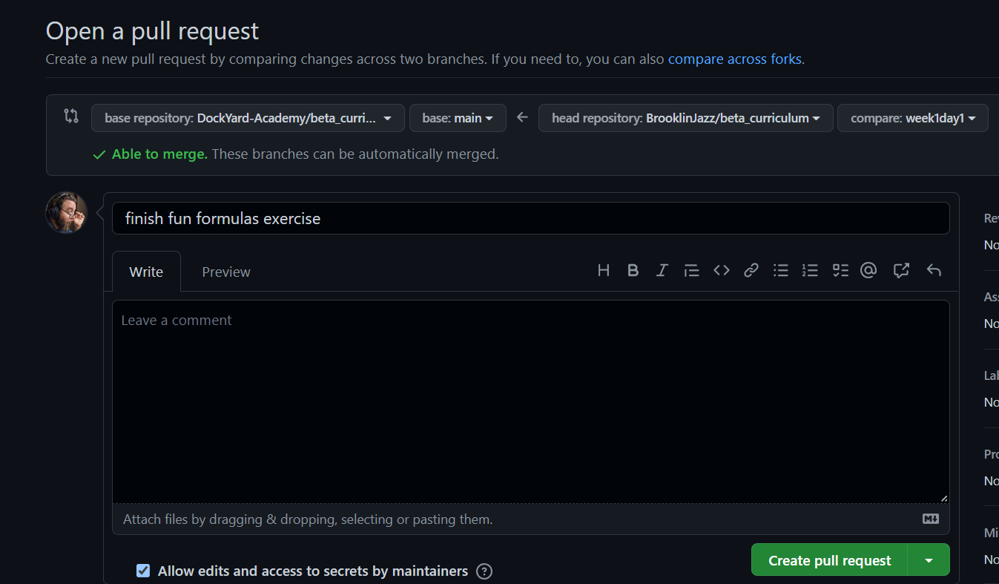

# Contributing

DockYard Academy aspires to create a supportive and inclusive environment. We welcome pull requests from everyone and from all experience levels. If you encounter any issues please [Raise An Issue](https://github.com/DockYard-Academy/curriculum/issues/new?assignees=&labels=&template=issue.md&title=) and describe your problem to get help.

## Set Up A Code Editor (Recommended)

We recommend you install Visual Studio Code as your primary code editor for this course:
https://code.visualstudio.com/

While this is not mandatory, we highly recommend using Visual Studio Code for it's ability to use LiveShare for collaborative code editing.

## Install Livebook

DockYard Academy is built using [Livebook](https://livebook.dev/), which allows you to run Elixir Notebooks.

Follow the [Livebook Installation Guide](https://livebook.dev/#install) to install Livebook Desktop or Livebook using escripts if you prefer using the command line or are a Linux user.

## Fork the Repository

To contribute to this project, you need to create a version of the project that you control. This version is called a **fork** or **forked repository**.



You can create a fork by pressing the fork button in the top right corner of the GitHub repository or [click this link to create a fork](https://github.com/DockYard-Academy/curriculum/fork)

## Clone the Repository

The forked repository is stored remotely on GitHub, so you need to download the codebase onto your local computer. We call this process **cloning** because we're downloading a copy (a clone) of the remote repository onto our local computer.



To do this, press the green **CODE** button on your forked repository and copy the URL provided.



Then run the following command in the command line from the folder you want to create your `curriculum` folder in.
<div style="background-color: lightcoral; font-weight: bold; padding: 1rem; color: black; margin: 1rem 0;">Ensure you replace URL with the copied URL</div>

```
git clone URL
```

This should create a local copy of the project on your computer.

## Keep `main` Branch Unchanged

Git repositories use multiple branches to keep track of changes you make to the codebase.
Branches typically branch off of the `main` branch, which holds the main version of the codebase.

In general, you want to avoid creating changes directly on the `main` branch and instead create new branches to make your changes on.



## Update Main

If we make significant changes to `main` you may want to update your fork before submitting a Pull Request. To update `main`, click the **Sync Fork** button from your forked repository on GitHub.



Once you have the latest changes on your remote repository, you need to download them to your local repository. We call this process **pulling**.



Changes must be pulled to your `main` branch on your local repository, so ensure you are on this branch by running the following from your command line in the `curriculum` folder.

```
git checkout main
```

Then run the following command from your command line in the `curriculum` folder to pull the latest changes.

```
git pull
```

We recommend doing this regularly as we make significant changes daily.

If you are running the project with Livebook, make sure you completely stop the Livebook project either by stopping it from the command line, or closing the Desktop Application.

<div style="background-color: lightcoral; font-weight: bold; padding: 1rem; color: black; margin: 1rem 0;">It is not enough to close the browser, you must stop the application otherwise you may retain an old version of opened files.</div>

## Create A Solutions Branch

If you are interested in completing DockYard Academy content, create a solutions branch.
To create a new solutions branch, run the following from the `curriculum` folder in your command line. You may replace `2022-10-1` with any branch name.

```
git checkout -B 2022-10-1
```

If you update your `main` branch, and wish to have the latest changes, we generally recommend creating a new solutions branch rather than trying to merge the latest changes with your existing solutions branch to avoid any potential merge conflicts.

## Create a Feature Branch

If you are contributing to the project, create a new branch for the specific contribution you would like to make. We have no strict name structure, however we recommend you pick a branch name related to the problem you are trying to solve such as:

- `fix-typo-in-enum-reading`
- `issue-769`
- `content-review`

Ensure you create your feature branch while on the `main` branch, otherwise you may accidentally include solutions to exercises in your Pull Request.

First, checkout into the `main` branch if you are not already on the `main` branch.

```
git checkout main
```

Follow the steps for updating main, then create your new feature branch. Replace `feature-branch-name` with your desired branch name.

```
git checkout -b feature-branch-name
```

## Run Tests

From the `curriculum/utils` folder, run the following command to run all tests.

```
mix test
```

Ensure all tests pass before submitting any Pull Request. Tests should provide you with a hint if there is any issue.

## Run Tasks

We have several [Mix Tasks](https://elixirschool.com/en/lessons/intermediate/mix_tasks) which handle automated tasks such as adding navigation, formatting lessons, and spellchecking.

Before submitting any Pull Request, run the following command from the `curriculum/utils` folder.

```
mix bc
```

If there are any changed files, ensure you include them when you create your Pull Request.

## Stage, Commit, and Push Changes

Now, make your desired changes to the project. add and commit changes as you make them.
You may choose to use the command line, or perhaps the **Source Control** tab in Visual Studio Code or your preferred code editor.

The `git add` command stages changes that you want to include in your next commit. `git add .` stages all changes in the current folder.

```
git add .
```

Once you have staged the changes you want in your next commit, you may commit them using the following command. Put a description of your work between the two quotes `""`. Consider making small, frequent commits to regularly save your work.

```
git commit -m "fix typo"
```

Once finished with your changes, you need to push your changes to your remote repository.



In order to push changes from your local branch to your remote forked repository, you must connect them. The branch on the forked repository is called the **upstream**.

Run the following command to create a remote upstream branch, then push your local changes to the remote upstream branch. Replace `branch-name` with the name of your branch.

```
git push --set-upstream origin branch-name
```

Alternatively you can just run `git push` and let the warning message tell you what command to run.

<div style="background-color: lightcoral; font-weight: bold; padding: 1rem; color: black; margin: 1rem 0;">The following code is meant for example purposes only, do not run it in your command line.</div>

```
$ git checkout -b example-branch
$ git push
fatal: The current branch example-branch has no upstream branch.
To push the current branch and set the remote as upstream, use

    git push --set-upstream origin example-branch
```

## Create a Pull Request

Once you have pushed your local changes to your remote forked repository, you need to create a pull request from your forked repository to the original DockYard Academy repository.



To make a pull request, go the the **Pull Requests** tab on your remote repository and click **Create Pull Request**.



Ensure that you are creating a pull request from your forked repository branch to the `main` branch of DockYard Academy.



Click **Create Pull Request**. Fill in a title and description for the pull request and click **Create Pull Request**. This should create a Pull Request that is ready for review by a maintainer.

We have no strict guidelines on titles or descriptions. Simply do your best to capture what the PR accomplishes in simple language. Include screenshots where applicable.

## Ensure Remote CI Passes

We run [GitHub Actions](https://github.com/features/actions) for spell checking and tests on every Pull Request. If it is your first Pull Request on the project these will have to be approved by a Maintainer. Otherwise, the GitHub Actions should run automatically.

Ensure that all GitHub Actions Pass after submitting your Pull Request.

## Review Your Changes

We recommend reading through your code changes after submitting your Pull Request.

First, find your Pull Request in the [DockYard Academy Pull Requests](https://github.com/DockYard-Academy/curriculum/pulls) tab. Then click on the **Files Changed** tab to view your changed files. Ensure there are no issues and that you are happy with your changes.

## Receive a Pull Request Review

A maintainer will review your pull request as soon as possible and provide feedback for changes where needed.

## Writing Contribution Guide
If you fix DockYard Academy Content or submit new content, please keep the following writing tips in mind.
- Code keywords such as `defimpl`, `defprotocol`, and `end` should use backticks (``).
- New concepts should be in **bold** the first time you introduce them, and should be explained.
- Use title case without a period in headers. i.e `"### Title"`. We have a task that automatically enforces this so don't worry about it too much.
- Code should be in an executable elixir cell unless it is pseudocode or reduces the lesson's clarity.
- Text should be run through [grammarly](https://app.grammarly.com/) or an alternative grammar checking program to ensure correctness. The free Grammarly features should be sufficient.
- Lessons should have a hidden setup section at the top of the Livebook for any necessary dependencies.
- Each major concept should have a new section. In addition, each section should try to provide at least one student interaction portion, typically using the **Your Turn** heading.
- **Hints** and **Example Solutions** should be provided using the details component (these styles look nicer in Livebook):

# Templates

Use the following templates for common LiveBook elements.

## Hint

<details style="background-color: burlywood; padding: 1rem; margin: 1rem 0;">
<summary>Hint</summary>

Have you tried turning it off and on again?

</details>

## Example Solution

<details style="background-color: lightgreen; padding: 1rem; margin: 1rem 0;">
<summary>Example Solution</summary>

```elixir

```

</details>

## Further Reading

Consider the following resource(s) to deepen your understanding of the topic.

* [Elixir Schools: Maps](https://elixirschool.com/en/lessons/basics/collections#maps-6)
* [Exercise: Maps](https://exercism.org/tracks/elixir/concepts/maps)
* [Elixir Lang: Pattern Matching](https://elixir-lang.org/getting-started/pattern-matching.html)
* [Elixir Lang: Maps](https://elixir-lang.org/getting-started/keywords-and-maps.html#maps)

- Mastery exercises should have the following blub at the top of the document.

## Mastery

Mastery assignments are bonus projects designed to incorporate curriculum concepts at an advanced level. You have complete freedom with how you complete mastery assignments, and may change requirements as you see fit. Each mastery assignment serves as an independent project you may choose to include on your portfolio of projects.

## Push To GitHub

Ensure all of your tests pass.

```
mix test
```

**ONLY If you cloned the project**: remove the existing `.git` folder, and re-initialize the project.

```
$ rm -rf .git
$ git init
```

[Create a new GitHub repository](https://github.com/new) and follow the instructions to connect your local project to your new remote project.

Stage, commit, and push your changes to GitHub.

```
git add .
git commit -m "associate books with authors"
git push
```

## Review Questions

Upon completing this lesson, a student should be able to answer the following questions.

* Question 1
* Question 2
* Question 3
* Question 4

## (Bonus) Further Study

A student who wants to do further research beyond this material may consider the following questions as inspiration. 

* Question 1
* Question 2
