### Lists vs Tuples

You might notice that tuples and lists seem very similar, and they are. They are both
data types that contain a collection of elements.

The major difference is performance. Both are good at different things. In Elixir,
it's fast to retrieve an element from a tuple, however it's slow to add a new element in.

Why? Well, that requires some understanding of how memory works in a computer.
The short version is that a tuple is stored continuously all together. So, you know where
each element is on the computer.

<!-- livebook:{"break_markdown":true} -->

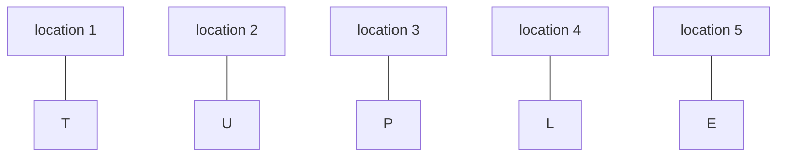

<!-- livebook:{"break_markdown":true} -->

However, if you want to add a new element in that means you have
to move the location of every element.

Lists on the other hand have the opposite strengths and weaknesses. Lists are stored
as **linked lists** which means each element in the list knows the location of the next element.

<!-- livebook:{"break_markdown":true} -->

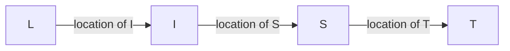

<!-- livebook:{"break_markdown":true} -->

So we can store elements in a list anywhere, if we need to add or remove a new element
we only have to change the location one element is pointing to.

However, we don't know the location of every element upfront like with a tuple, so if you
want to get the third element, you need to look through the first and second to find it.

## Comparison Operators
Comparison operators are not limited to comparing integers and floats. For example, they are often used to compare the equality of other data types.

```elixir
"hello" === "hello"
```

```elixir
%{hello: "world"} === %{hello: "world"}
```

```elixir
["hello", "world"] === ["hello", "world"]
```

## Booleans
Programming languages hide the internal details of how computers work. This allows us as
developers to think at a high level. However, it's still useful to be aware of some of the inner workings.

Under the hood, computers store electrical signals. You can think of this like powering a 
lightbulb but on a much smaller scale. An electrical signal is either **on** or **off**, and by manipulating
these electrical signals, we are able to create complex information and instruction.

You may have seen movies or tv series that show coding as a bunch of `1`s and `0`s
. A 0 represents a signal that's **off** and a `1` represents a signal
that's **on**. These `0`s and `1`s are called **binary**.

After we write our Elixir code, our instructions are then converted or **compiled** into binary.
**binary** is the machine code that the computer actually understands.

So, you might wonder how we go from `0`s and `1`s to creating rockets, websites, self-driving
cars, smartphones, and 3D animations.

Well let's take the first step with booleans. A boolean (BOO-LEE-AN). 
is a `true` or a `false` value. Conceptually, this is a direct representation of
`on` and `off` in your program.

There are only two booleans.

## Control Flow Overview
* **Pattern matching** with the **match operator**
* Using `with` to check a series of conditions before entering a path.
* using **Multi-clause functions** with **pattern matching**
* Handling errors with the :ok, and :error tuple and **pattern matching**

## Enum
Which means you can also use pattern matching on the elements in a map.

```elixir
Enum.map(%{key: "value"}, fn {_key, value} -> value end)
```


Map keys can still be any type in the tuple.

```elixir
Enum.map(%{%{} => "value"}, fn {key, _value} -> key end)
```

You can use pattern matching inside of the function.

```elixir
Enum.map([one: 1], fn {_key, value} -> value end)
```

## WHy use polymophism
### Why Use Polymorphism?

Instead of specific constructs that enable polymorphism, 
you can instead use control flow constructs like `if`, `cond`, and `case` to
alter the behavior of your programs.

Often though, we use polymorphism to improve the clarity of your code where `if`, `cond`, and `case`
would become less clear. For example, let's say we don't use polymorphism with multiple arity functions
and instead write a single function with a list for the parameter.

We'd need to check the length of names with `length/1`,
and retrieve each element in the list.

```elixir
defmodule Greeter do
  def hi(names) do
    case length(names) do
      1 -> "Hi #{Enum.at(names, 0)}!"
      2 -> "Hi #{Enum.at(names, 0)} and #{Enum.at(names, 1)}!"
      _ -> "Hi everyone!"
  end
end
```

Is it better or worse? It's not always clear-cut, but it's useful to
rely on polymorphism when it would improve the clarity of your code.

## Lesson 2: Operators

## Setup

Ensure that you evaluate all code using the `ea` keybinding. Press the `e` then the `a` key.

```elixir
Mix.install([{:kino, github: "livebook-dev/kino"}])
```

## Overview

You can think of all programming as split into data and behavior. In the previous lesson,
you learned all about data, and in this lesson, you're going to learn about behavior.

### Operators

To operate means to control a machine, process, or system.
Thus we have **operators** which control the behavior of our program.

In this lesson, you're going to learn:

* **Arithmetic operators** performing mathematical operations. `+`, `-`, `*`, `/`, `div`, and `rem`
* **Match operator** binding data to a variable. `=`
* **Comparison operators** comparing values to one another. `===` `==` `>=` `<=` `<` `>`
* **Boolean operators** comparing booleans and truthy values. `and` `or` `not` `&&` `||` `!`
* **String operators** manipulating strings. `<>`, `#{}`
* **List operators** manipulating lists. `++` `--`
* Accessing map values with **map.key** notation and **map[key]** notation.


## Combining Operators

So far, you've only used operators in isolation. But it's important to remember that you
can use them in combination.

```elixir
2 + 3 > 4
```

```elixir
"4 + 7 is greater than 8 and 2 + 10 is less than 20: #{4 + 7 > 8 && 2 + 10 < 20}"
```

### Your Turn: Min Max Program

Here's a small program that checks if a variable is between two integers.

You'll notice that code can include line breaks to make it easier to read.

Try setting `input` to `15` to see it return. `"15 is between 10 and 20"`.

```elixir
input = 5
max = 20
min = 10

(input < max && input > min &&
   "#{input} is between #{min} and #{max}") || "#{input} is outside #{min} and #{max}"
```

### Your Turn: Rock Paper Scissors

In the Elixir cell below, You're going to create the perfect AI for rock paper scissors.
You should only need to use `&&`, `=`, `===`, `||` operators.

* Create a variable `input` and bind it to `"Rock"`.
* Use **comparison** operators to check if input equals "Rock" then return "Paper"
* Bonus: handle if input equals "Paper" then return "Scissors"
* Bonus: handle if input equals "Scissors" then return "Rock"

```elixir

```

## Syntax Errors

`Syntax` refers to the keywords and symbols you use to provide instruction to the computer through
Elixir. If you do not follow the rules that Elixir sets, your code will not
compile into instructions for the computer, and you will see a red `error` message.

Sometimes your code is valid, but you may still see a yellow `warning`. Warnings let you know
that you might be making a mistake in your program, but the code still compiles into valid
instruction.

In general, in programming, you have to be precise. A single misplaced character causes your entire
program to stop working!

Take care to regularly evaluate any code you're writing to ensure
it compiles. Regularly verifying your code compiles makes it a lot easier to know if a 
change triggered an error or warning.

Elixir does its best to let you know the cause of your error, but it can take some time to get used to reading these messages.

For example, here's the error messages you receive when you have a dangling operator without a 
value on the right-hand side.

```elixir
2 *
```

In general, errors will provide you an **error type**, **error message**, **line number**, 
and even the **code causing the crash**

Here's what the error above tells us.

* **Error type**: **TokenMissingError** because we're missing the next token 
  (in this case a number) in the `2 * number` expression.
* **Error message**: `syntax error: expression is incomplete `
* **Code causing the crash**:
  ```elixir
    |
  1 | 2 *
    |   ^
  ```
* **Line number**: the crash is on **line 1**

### Your Turn

In the Elixir cell below, Reproduce a crash by writing `"hello" <>`.
Then, try using `Enter` to create a new line and shift the code down to **line 2**. See how the 
error is different now.

```elixir

```

# Modules and Functions

## Setup

```elixir
require Integer
```

## Overview

You're about to unleash the full power and potential of programming.

Data structures and operators are fundamental for providing instructions 
to the computer, but you're limited in how repeatable and reusable those
instructions can be.

For example, if you want to determine if many numbers are even, you must repeatedly reimplement that behavior.

Reusing repeatable instructions makes programming far more powerful. 
This is because each solved problem acts as a building block for the next.

### Abstractions

To abstract in our context means to reduce complexity by hiding implementation details.

You work with abstractions all the time. For example, it was mechanical and complex when you first learned to walk. Now you move without even thinking about it.

Any machine you operate is an abstraction. Do you drive? You've probably
never needed to think about the complex machinery triggered by turning a wheel. How about typing? That's right. Your keyboard is an abstraction for the complex electrical signals required to communicate with your computer.

Human beings have limited brains, so we deal with complexity by creating abstractions.

### Breaking Down Problems

In programming, we rely on abstractions in much the same way. We figure out how to solve small 
problems, and then we reuse those small abstractions to solve more significant challenges.

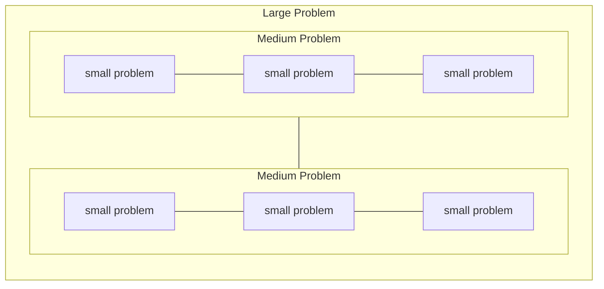

### How do we Build Abstractions?

**Modules** and **functions** are the primary tools
we have to create abstractions and repeat behavior.

In total this lesson will cover:

* How to abstract away implementation details with **functions**.
* How to create **multi-parameter functions** accept multiple inputs.
* An alternative **shorthand syntax** for functions.
* How we can use **first-class functions** as values in **higher-order functions**
* How to group functions in a **module**.
* **Private** and **public** functions in a module.
* Using **module attributes** to create reusable constant values between module functions.
* How to achieve **polymorphism** with **multiple function clauses**.
* How to compose functions together using the **pipe operator**.
* Validating function input with **guards**.

## Functions

Elixir is a Functional programming language. So you can imagine that Functions must be important. But what is a function?

### Input and Output (IO)

A function is a set of repeatable instructions. A function accepts some **input**, and returns
some **output**.

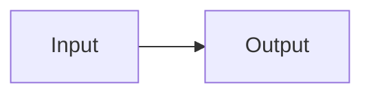

### Black Box

How the function converts some input to some output is often referred to as a **black box**.
It's a black box because you don't need to know (or can't know) the details of how it works.

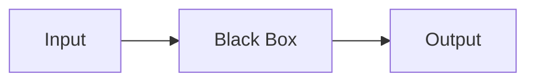

### Creating a Function

Let's create a function called `double` which will take in a number and
double its value.

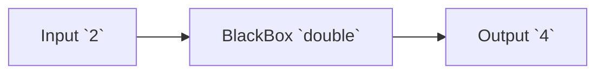

Now, let's create our first function. At first, it's going to do nothing.
A function must have an output. We can return `nil` for now.

```elixir
double = fn -> nil end
```

You may see some weird-looking output like `#Function<45.65746770/0 in :erl_eval.expr/5>`.
Don't worry too much about that. It's how Elixir represents a function internally.

### Parts of a Function

Let's break down what we did above.

1. `double` is a variable name. Often you'll refer to it as the **function name**. 
   It can be any valid variable name.

2. We bind `double` to an **anonymous function**.
   The anonymous function is everything from the `fn` to the `end`.

   ```mermaid
   flowchart LR
    A[function name] --> B[=]
    B --> C[anonymous function]
   ```

3. Elixir uses the `fn` keyword to define a function.

4. The next value `->` separates the **function head** and the **function body**.

5. The **function head** describes the input of the function. In this example, it's empty.

6. The **function body** contains the function's implementation or **black box** . In this example, it returns `nil`.

7. Elixir uses the `end` keyword to stop creating a function.

<!--  -->

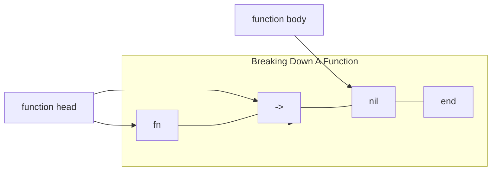

### Calling a Function

Our `double` function doesn't do much at this point, but let's see the **output** that it returns.

We use the `.()` syntax in Elixir to get the function's output. We often say we are **executing** or **calling** a function.

```elixir
double.()
```

`double` should return `nil` because that's all we've told it to do so far. However, we want
it to multiply a number by `2`.

To do that, we need to make the function accept some input. To do this,
we define a **parameter** in the function like so.

```elixir
double = fn parameter -> nil end
```

You'll notice a warning above. That's because Elixir is smart and lets us know that we've
created a parameter, but we're not using it. In Elixir, if you want to have an unused variable
without warning, you can mark it with an underscore `_`

```elixir
double = fn _parameter -> nil end
```

No more warning 😀 But we actually want to use that parameter, so let's 
modify the function to return the parameter instead.

```elixir
double = fn parameter -> parameter end
```

The parameter is named parameter here for the sake of example. But it works a lot like a variable, and it can be named anything.
Let's rename it to `number` to clarify what we expect the input to the function to be.

```elixir
double = fn number -> number end
```

Now the function head takes in a value. We have to pass it
an **argument**when we call it. The argument is binded to the parameter when the function 
executes. We'll give it the integer `2`.

```elixir
double.(2)
```

Under the hood, when the function runs, the parameter is binded to the argument's value.

Step by step, that would look like this.

<!-- livebook:{"force_markdown":true} -->

```elixir
double = fn number -> number end
double.(2)
fn 2 -> 2 end
2
```

<!-- livebook:{"break_markdown":true} -->

Notice that if you try to call the function without an argument, it fails because
it expects an argument. Not all languages do that, but Elixir is pretty smart 😎

```elixir
is_even.()
```

Great, now all that's left is to multiply the parameter by `2`. You should be familiar with 
this from the previous sections.

```elixir
double = fn number -> number * 2 end
```

And you can use it to double any number.

```elixir
double.(10)
```

```elixir
double.(11)
```

```elixir
double.(10 ** 2 - 1)
```

### Implied Return Values

Some languages require explicit return values.

However, in Elixir the output of a function is always the last line.

For example, notice that the return value below is `first` + `second`, which equals `3`.

```elixir
multiline_function = fn ->
  first = 1
  second = 2
  first + second
end

multiline_function.()
```

## Multi-Parameter Functions

Functions can accept multiple inputs. Separate parameters with commas `,` to create a multi-parameter function.

Let's say you're creating a function `calculate_force`, which will take in `mass` and
`acceleration`. (remember that force = mass * acceleration)

Let's start with the `double` function and see how we could convert it into a `calculate_force` function.

```elixir
double = fn number -> number * 2 end
```

First, let's rename `double` to `calculate_force` and rename `number` to `mass`. That gets us
most of the way there!

```elixir
calculate_force = fn mass -> mass * 2 end
```

Technically, we've got a function that calculates the force of an object with a given mass and
an acceleration of 2.

However, we want it to be truly reusable, so we need to figure out how to replace 2 with another
parameter. You can declare a function that accepts multiple parameters by separating them with a 
comma `,` as you do in a list or tuple.

```elixir
calculate_force = fn mass, acceleration -> mass * acceleration end
```

That should be working! Now you can call the function by passing in two arguments the same way.

```elixir
calculate_force.(10, 2)
```

Keep in mind that the first argument will be the value of the first parameter, and the second argument
will be the value of the second parameter. You can repeat this with as many parameters as you want!

```elixir
example = fn a, b, c, d, e -> [a, b, c, d, e] end

example.(1, 2, 3, 4, 5)
```

But usually, you want to avoid having too many parameters because it makes your function hard
to understand.

A parameter can be bound to any valid data type, so you could instead use associative data
a structure like a map or keyword list.

```elixir
is_even = nil
```

## Shorthand Syntax

Anonymous functions can be defined using a shorthand syntax. It is only an alternative and shorter
version to define a function. You will sometimes see shorthand syntax, so it's helpful to understand it.
However, it should not be over-used. Otherwise, your program may be less clear.

You can still bind the anonymous function to a variable with the shorthand syntax.
However, you define the function with `&()` and put the function body between the brackets.

Here's the same `double` function using short-hand syntax.

```elixir
double = &(&1 * 2)
double.(5)
```

`&1` means the first parameter. If the function had more parameters, you could access them with `&2`, `&3`, and so on.

```elixir
add_two = &(&1 + &2)
add_two.(2, 3)
```

### Function Arity

The number of parameters your function accepts is called the **arity** of the function.

A function with no parameters has an arity of zero. A function with one parameter has
an arity of one, and so on.

You refer to the function as **function_name/arity** thus a function named `add_two` with two parameters
is called `add_two/2`.

## First-class Functions

Functions in Elixir are [first-class citizens](https://en.wikipedia.org/wiki/First-class_citizen).

For our purposes, this means we can bind functions to variables, store them in other data types, pass them as arguments to other functions.

If a function takes in another function as a parameter, it's called a **higher-order function**.

For example, we could make a function named `call_twice`, which calls a function on a value twice.

```elixir
call_twice = fn function, parameter -> function.(function.(parameter)) end
```

We'll use our `double` function and create a quadruple result.

```elixir
double = fn number -> number * 2 end

call_twice.(double, 3)
```

We don't need to bind the passed function to a variable first. We can pass 
in the anonymous function directly.

```elixir
call_twice.(fn number -> number * 2 end, 5)
```

Whenever you pass a function into a higher-order function with the 
expectation that the higher-order function is going to call it, the passed function is
referred to as a **callback function**.

## Pipe Operator

To create more complex behavior, you'll often compose smaller functions together. Composing functions together reflects
nature of problem-solving where we take large problems and break them down into smaller ones.

To help compose functions together, Elixir provides the pipe `|>` operator.
That's the `|` symbol likely above your enter key, and the greater than `>` symbol side by side to make `|>`.

The pipe operator allows you to take the output of one function and pass it in as an argument
for the input of another function.

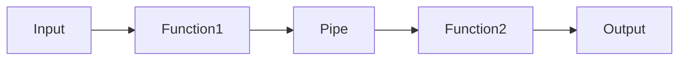

Why is this useful? Without the pipe operator you can wind up writing deeply nested function calls.

<!-- livebook:{"force_markdown":true} -->

```elixir
four.(three.(two.(one.())))
```

But with the pipe operator, you can chain functions together.

<!-- livebook:{"force_markdown":true} -->

```elixir
one.() |> two.() |> three.() |> four.()
```

If a function is called with multiple arguments, the function piped in will be the first argument.

<!-- livebook:{"force_markdown":true} -->

```elixir
two(1, 2) # how to call two/2 by itself.

# How to use the pipe operator
# to call the two/2 with one/1 as the first argument.
one.() |> two.(2)
```

You can also pass in a value to a pipe.

<!-- livebook:{"force_markdown":true} -->

```elixir
1 |> two.()
```

The pipe operator doesn't change the behavior of a program. Instead, the pipe operator
exists as syntax sugar to improve the clarity of your code.

```elixir
add_grapes = fn shopping_list -> shopping_list ++ ["grapes"] end
add_pizza = fn shopping_list -> shopping_list ++ ["pizza"] end
add_blueberries = fn shopping_list -> shopping_list ++ ["blueberries"] end

[]
|> add_grapes.()
|> add_pizza.()
|> add_blueberries.()
|> add_pizza.()
|> add_blueberries.()

# vs the alternative
add_blueberries.(add_pizza.(add_blueberries.(add_pizza.(add_grapes.([])))))
```

## Modules

As you create more and more functions, it becomes necessary to organize them. That's just one of the many reasons to use a **module**. A module is more or less a "bag of functions".

Here's what an empty module looks like.

```elixir
defmodule Hello do
end
```

Again, don't worry about the somewhat strange-looking return value. 
`{:module, Hello, <<70, 79, 82, 49, 0, 0, 4, ...>>, nil}` That's how Elixir represents 
modules internally.

Let's break down what this all means.

1. `defmodule` a keyword that means "define module".
2. `Greeter` is the name of this module. It can be any valid name, and is usually **CapitalCase**.
   you'll often heard the name of the module referred to as the **namespace** that functions are organized under.
3. `do` a keyword that separates the module name and its internal implementation.
4. `end` a keyword that finishes the module definition.

Modules define functions inside of them. Each function has a name, so they are called **named functions**.
You can define functions inside a module using the following syntax.

```elixir
defmodule Greeter do
  def hello do
    "hello world"
  end
end
```

Let's break down the named function above.

1. `def` this means "define function"
2. `do` a keyword that separates the function head and the function body.
3. `"hello world"` this is the function body. This function returns the string "hello world"
4. `end` is a keyword that ends the function definition.

### Calling a Named Function

To call a function inside a module, you use `Module.function(args)` syntax.

```elixir
Greeter.hello()
```

### Named Functions with parameters

You can create multiple functions in a module.

Here's a new `hi/1` function that says hi to a person.

```elixir
defmodule Greeter do
  def hello do
    "hello world"
  end

  def hi(name) do
    "hi #{name}"
  end
end
```

You call the named function in the module by passing it an argument.

```elixir
Greeter.hi("Brooklin")
```

## Internal Module Functions

A module can use its own functions.

```elixir
defmodule InspectorGadget do
  def gogo(gadget) do
    "Go go gadget #{gadget}!"
  end

  def necktie do
    InspectorGadget.gogo("Necktie")
  end
end

InspectorGadget.necktie()
```

However, you can omit the module name. notice `gogo` instead of `InspectorGadget.gogo`

```elixir
defmodule InspectorGadget do
  def gogo(gadget) do
    "Go go gadget #{gadget}!"
  end

  def necktie do
    gogo("Necktie")
  end
end

InspectorGadget.necktie()
```

## Private Functions

Modules can access other module functions.

```elixir
defmodule Speaker do
  def speak() do
    "hi there"
  end
end

defmodule Listener do
  def listen() do
    "I heard you say: " <> Speaker.speak()
  end
end

Listener.listen()
```

However, sometimes a module must keep a function private for internal use only. Why?
It may be for security reasons or because you don't think it's unnecessary to expose the function to the outside world. 
Often it communicates to other developers how to use your module.

You can create a private module function with `defp` instead of `def`. You'll notice that below the 
`Speaker.think/0` function is undefined to the outside world.

```elixir
defmodule Speaker do
  defp think() do
    "hi there"
  end
end

Speaker.think()
```

We use private functions internally in the module, which means that public functions could expose their values.

```elixir
defmodule Speaker do
  defp think() do
    "hi there"
  end

  def speak() do
    think()
  end
end

Speaker.speak()
```

## Module Attributes

What if you have many functions in a module that all use the same value? You've already learned
that repeating the same hard-coded value over and over again isn't very reusable, and you've
used variables to pass the same value around in your code. However, that's not possible in a module.

Modules and functions in a module close themselves to the outside world. We call this `scope`.
Modules, functions, and many other similar constructs in Elixir are `lexically scoped.

That means that variables defined in one scope cannot be accessed in another scope.

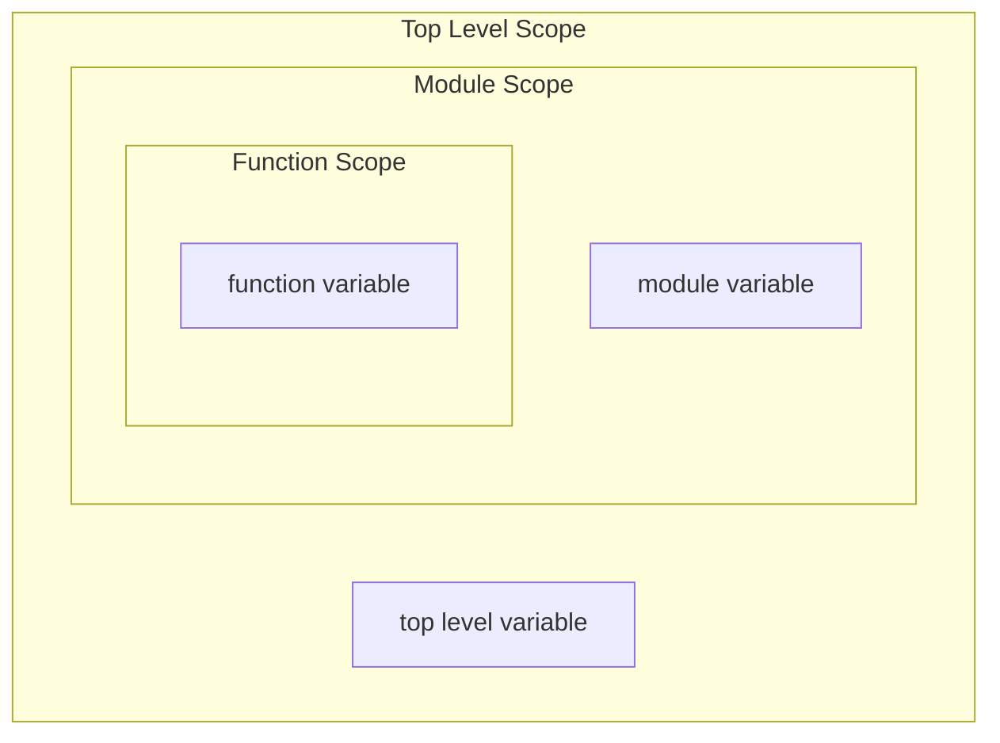

Notice how the following example has an error because we cannot access the variable 
`top_level_scope`

```elixir
top_level_scope = 1

defmodule MyModule do
  def my_function do
    top_level_scope
  end
end
```

The same is true for the module scope.

```elixir
defmodule MyModule do
  module_scope = 2

  def my_function do
    module_scope
  end
end
```

To get around this, Elixir allows you to store constant values as module attributes 
using the `@module_attribute value` syntax. You can then access the `@module_attribue` value in 
any module function.

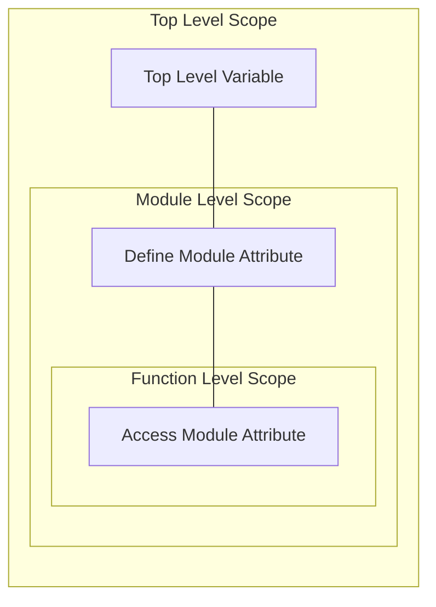

Notice that we can use a module attribute inside of the module's function now.

```elixir
defmodule MyModule do
  @my_attribute "any valid data type"
  def my_function do
    @my_attribute
  end
end

MyModule.my_function()
```

We can also access a variable in the top-level scope as long as we set a module attribute.

```elixir
top_level_variable = 1

defmodule MyModule do
  @my_attribute top_level_variable
  def my_function do
    @my_attribute
  end
end

MyModule.my_function()
```

Now we can easily share constant values between multiple module functions.

```elixir
defmodule Hero do
  @name "Batman"
  @nemesis "Joker"

  def catchphrase do
    "I am #{@name}."
  end

  def victory do
    "I #{@name} will defeat you #{@nemesis}!"
  end
end

Hero.victory()
```

If the module attribute value changes, you only need to change the module attribute.

```elixir
defmodule Hero do
  @name "Iron Man"
  @nemesis "Iron Monger"

  def catchphrase do
    "I am #{@name}."
  end

  def victory do
    "I #{@name} will defeat you #{@nemesis}!"
  end
end

Hero.victory()
```

## Multiple Function Clauses

Elixir allows us to define multiple functions with the same name but that expect different parameters.
This means the function has multiple function clauses.
For example, we can take our `hi` function and create a new version that says hi to two people.

```elixir
defmodule Greeter do
  def hi(name1, name2) do
    "hi #{name1}, hi #{name2}"
  end

  def hi(name) do
    "hi #{name}"
  end
end

Greeter.hi("Peter Parker", "Mary Jane")
```

In the example above, each function has a different **arity**. You can treat each function with
a different arity as a different function. We often refer to each function by its arity
as function/arity.

So the `Greeter` module has a  `hi/1` (hi one) function and `hi/2` (hi two) function.

## Polymorphism

The word polymorphism comes from the Greek word for "many shapes".
It means essentially the same thing for our programs.
We often want to define a single general behavior, but apply it to different things.

In the example above, we use multiple function clauses to achieve polymophism using the same
generic `hi` function to say hi to one person, or two people. Earlier, we also achieved polymorphism 
with the `call_twice` function, which abstracts a generic repeatable behavior, but does not
care about the specific function that it's calling twice.

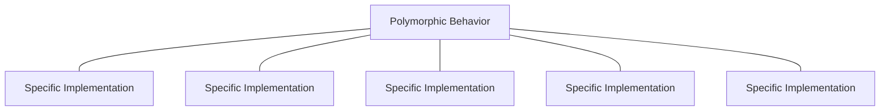

Running is a great real-world example of polymorphism. Many different animals run,
and they all run in different ways.

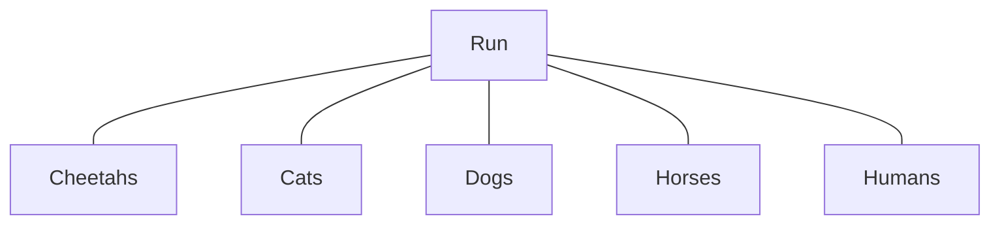

# Structs, Built-In Modules, Behaviors, and Protocols

## Setup

```elixir
require Integer
```

## Overview

Have you ever heard the expression "Reinventing the wheel?". Essentially it means repeating
a useless action or solving an already solved problem.

In programming, it's important to avoid reinventing the wheel, and instead rely on previously
existing solutions. Sometimes those previously existing solutions are our own!

In the previous lesson you learned about how to use modules and functions in order to 
abstract away generic and reusable behavior.

We also talked about polymorphism. Polymorphic code maintains consistent behavior while changing
the underlying implementation.

In this lesson, you'll learn about more constructs and built-in tools Elixir provides to enable
reusable code and polymorphic code.

In this lesson we'll talk about:

* Custom reusable data structures with **Structs**.
* Reusable pre-built functionality with **Built-In Elixir Modules**.
* Polymorphic code with **Behaviours**.
* Polymorphic code with **Protocols**.

### Mutation

Under the hood, the values bound to variables are stored on the computer.

The variable, is actually pointing to the value in that location.

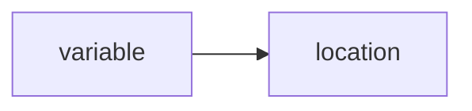

For example, a variable `hello` with the value `"world"` would store the string
`"world"` somewhere in **memory**. **memory** is a hardware component on the computer.
You may have heard of **RAM** (Random Access Memory).


Object Oriented Programming languages allow you to mutate the actual value in memory.
So when we write `hello = 4`, the data `"world"` mutates into `4`.


However, in a functional programming language like Elixir, we do not allow mutation.
So instead of mutating the data, we **rebind** the variable to new data.

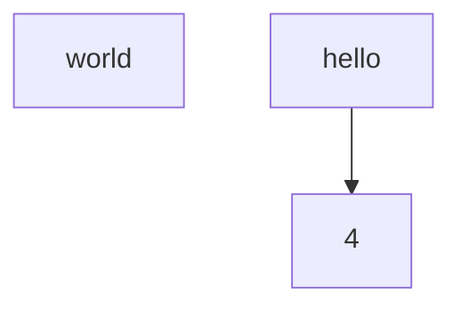

```elixir
hello = "hello"
hello_world = hello <> "world"
hello = "hi"
hello_world
```

```elixir
hello
```

You'll notice that if you rebind `hello` below to `4`, the Elixir cell above will still
have `hello` bound to `"world"`

```elixir
hello = 4
```

```elixir
hello
```

# What is Elixir?

## Elixir

Elixir and other programming languages allow you to represent information as data.
What does that mean?  Our job as programmers is often to translate project requirements 
into something that a computer understands. However, while computers can do computations in only a few seconds that would
take our entire lives, they only
do what we tell them to. So we have to provide incredibly explicit instruction.

The great thing about computers is they do what we tell them to. But, unfortunately, that means if something goes wrong, it's usually our fault.

Check out the 
[Exact Instructions Challenge: Peanut Butter and Jelly](https://www.youtube.com/watch?v=cDA3_5982h8&ab_channel=JoshDarnit) for a messy example!

To provide instruction to the computer, you need to understand the language it speaks.
Well, that's not entirely true. The actual language the computer speaks is in electrical signals 
represented as 0s and 1s. This is called **binary**. Instead of writing programs in binary
We have programming languages like **Elixir** that allow use to write instructions in
more or less plain English with some special words, characters, and restrictions.

Some programming languages look more like plain English, and other's definitely don't. 
There's even a programming language that let's you [write a program as a cow](https://esolangs.org/wiki/COW)!

```
MoO MoO MoO MoO MoO MoO MoO MoO MoO MoO MoO MoO MoO MoO MoO MoO MoO MoO MoO MoO MoO MoO MoO MoO MoO MoO MoO MoO MoO MoO MoO MoO MoO MoO MoO
 MoO MoO MoO MoO MoO MoO MoO MoO MoO MoO MoO MoO MoO MoO MoO MoO MoO MoO MoO MoO MoO MoO MoO MoO MoO MoO MoO MoO MoO MoO MoO MoO MoO MoO MoO
 MoO MoO Moo MoO MoO MoO MoO MoO MoO MoO MoO MoO MoO MoO MoO MoO MoO MoO MoO MoO MoO MoO MoO MoO MoO MoO MoO MoO MoO MoO MoO MoO Moo MoO MoO
 MoO MoO MoO MoO MoO Moo Moo MoO MoO MoO Moo OOO MoO MoO MoO MoO MoO MoO MoO MoO MoO MoO MoO MoO MoO MoO MoO MoO MoO MoO MoO MoO MoO MoO MoO
 MoO MoO MoO MoO MoO MoO MoO MoO MoO MoO MoO MoO MoO MoO MoO MoO MoO MoO MoO MoO MoO Moo MoO MoO MoO MoO MoO MoO MoO MoO MoO MoO MoO MoO MoO
 MoO MoO MoO MoO MoO MoO MoO MoO MoO MoO MoO MoO MoO MoO MoO MoO MoO MoO MoO MoO MoO MoO MoO MoO MoO MoO MoO MoO MoO MoO MoO MoO MoO MoO MoO
 MoO MoO MoO MoO MoO MoO MoO MoO MoO MoO MoO MoO MoO MoO MoO MoO MoO MoO MoO MoO MoO MoO MoO MoO MoO MoO MoO MoO MoO MoO MoO MoO MoO MoO MoO
 MoO MoO MoO MoO MoO MoO MoO MoO MoO MoO MoO MoO MoO MoO MoO MoO MoO MoO MoO MoO MoO MoO MoO MoO MoO MoO MoO MoO MoO MoO MoO MoO MoO Moo MOo
 MOo MOo MOo MOo MOo MOo MOo MOo MOo MOo MOo MOo MOo MOo MOo MOo MOo MOo MOo MOo MOo MOo MOo MOo MOo MOo MOo MOo MOo MOo MOo MOo MOo MOo MOo
 MOo MOo MOo MOo MOo Moo MOo MOo MOo MOo MOo MOo MOo MOo Moo MoO MoO MoO Moo MOo MOo MOo MOo MOo MOo Moo MOo MOo MOo MOo MOo MOo MOo MOo Moo
 OOO MoO MoO MoO MoO MoO MoO MoO MoO MoO MoO MoO MoO MoO MoO MoO MoO MoO MoO MoO MoO MoO MoO MoO MoO MoO MoO MoO MoO MoO MoO MoO MoO MoO Moo 
```

Some programming languages operate closer to the machine code the computer uses, 
these are called **low-level programming languages**. They are great for optimizing
performance but often much harder to read and understand.

Alternatively, other programming languages improve developer's quality of life by operating closer to human language. These languages are referred to as **high level programming languages**.
Elixir is a high-level programming language. It's developer-friendly and powerful.

Whatever programming language you're using, you need to understand how to convert real-world concepts
into instructions the computer understands. This lesson is going to focus on exactly that.
So, how do we represent real-world information as something the computer understands? The answer
is **data**. Depending on what type of information we want in the program, we use different **data types**.

For example, on your social media profile (Linkedin, Twitter, Instagram, etc), you often have to
store your name, birthday, and some of your interests.

Your name might be in a data type called a **string**.

```elixir
"Peter Parker"
```

The same goes with the month you were born.

```elixir
"August"
```

Sometimes we can use different data types to represent the same information. For example,
August is the 10th month, so we could use an **integer** instead.

```elixir
10
```

You will learn all of the data types below and what kinds of information they are good
at representing. Don't worry; this is just an overview of what you're about to learn.
You are not expected to be familiar with any of these data types yet.

* **Booleans** `true` and `false` values.
* **Integers** whole positive and negative numbers such as `1`, `345`, `0`, and `-98`.
* **Floats** positive and negative decimal numbers such as `1.3`, `31.54`, `0.0`, and `-65.2`.
* **Strings** text information such as `"Hello, world!"`.
* **Atoms** constants who's name is their value such as `:ok` and `:error`.
* **Lists** lists of information such as `[1, 2, 3]`.
* **Tuples** store multiple items of a known size `{5, 2, 1}`.
* **Ranges** ascending or descending series of numbers with a step such as `1..10`.
* **Keyword Lists** lists of information with associated keys and values `[hello: "world"]`
* **Maps** a key-value data structure `%{hello: "world"}`

# Error Handling
## Expected Errors

Now that you understand control flow and pattern matching, you're ready to tackle error handling.

Computers are nearly perfect. However, humans are not. Errors and bugs are part of life as
a programmer.

Sometimes we can anticipate potential errors. 
For example, what happens when you try to create a Date with an invalid month?

```elixir
Date.new(1998, 122, 21)
```

The module function returns an error tuple `{:error, :invalid_date}`.

For the errors that we expect, Elixir developers established a pattern of using
`:error` and `:ok` tuples.

```elixir
Date.new(1998, 12, 21)
```

Functions that anticipate errors return either
 `{:ok, data}` or `{:error, reason}`

<!-- livebook:{"break_markdown":true} -->

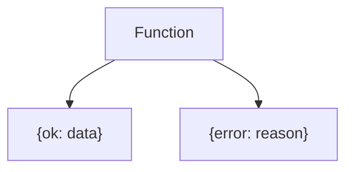

<!-- livebook:{"break_markdown":true} -->

This allows us to call these functions, and then use pattern matching to handle the `:ok` or `:error`
case.

<!-- livebook:{"break_markdown":true} -->

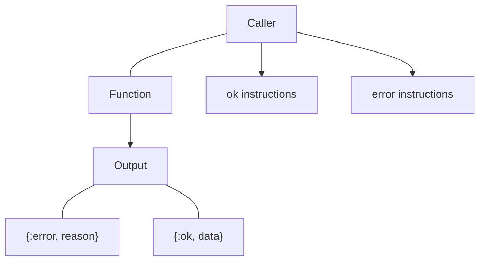

<!-- livebook:{"break_markdown":true} -->

The `Date` module expects that we'll sometimes call it with mismatched integers and it handles that
error specifically.

<!-- livebook:{"break_markdown":true} -->

This enables predictable error handling. We can use `case` to match on the `:error` and `:ok` tuples,
then handle them however is appropriate.

```elixir
case Date.new(1998, 12, 21) do
  {:ok, date} -> date
  {:error, reason} -> reason
end
```

### Your Turn

In the Elixir cell below, trigger the `:error` case by changing `Date.new(1998, 12, 21)` to an invalid
date.

```elixir
case Date.new(1998, 12, 21) do
  {:ok, value} -> value
  {:error, reason} -> reason
end
```

### Your Turn

Create a function `convert_to_12_hour`
which takes in an integer from 1 to 24. It will then return the equivalent time
on a 12 hour clock.

* 1 would become `{:ok, "1am"}`
* 14 would become `{:ok, "2pm"}`
* If the value given is less than 1 return `{:error, :time_too_low}`.
* If the value given is greater than 24 return `{:error, :time_too_high}`

## Unexpected Errors

While we can do our best to predict errors, it's truly impossible to predict them all. Some
errors are not within our control, such as the malfunction of physical hardware, some errors
result out of unexpected complexity and behavior.

Some errors result because of external systems, or malformed data, and some errors are because
we spelled **acceleration** with one **l** instead of two. 🤦‍♂️

Whatever the reason, unpredictable errors happen. In fact, 
Elixir has a philosophy of "Let it crash" which you'll learn more about in future lessons.

There are two main categories of errors. The first is a [RuntimeError](https://hexdocs.pm/elixir/1.13.2/RuntimeError.html).
A runtime error occurs while the program is running. That's why it's called a runtime error.

The other is a [CompileError](https://hexdocs.pm/elixir/1.13.2/CompileError.html)
. A compile error occurs during compile time. 
What is compile time? Compile time when the Elixir source code that you've written gets converted
into binary machine code instructions for the computer.

Elixir is a **compiled** language, so it's instructions get compiled into binary machine code before being
run. Alternatively, some languages are **interpreted**. Interpreted languages get converted into computer instruction as
they run rather than upfront.

Whenever you encounter an error, Elixir attempts to provide information about what
happened by raising an error.

What does **raise** an error mean? You may have noticed Elixir provides a variety of errors that help you understand what
went wrong in your program. Whenever Elixir encounters an error, it stops the current execution and displays an error.

You can manually raise a **RuntimeError** error with the `raise` keyword.

```elixir
raise "Oh no!"
```

You can also trigger a **CompileError** by writing some invalid Elixir syntax. Because Elixir
is compiled, it's able to pre-determine that the code is invalid before running it.

```elixir
you(cannot(just(write(anything))))
```

You've already been introduced to several other kinds of errors. It's not important
that you remember all of them, but you should try to understand what they mean when you see them.

* **FunctionClauseError**: a function is called with input that doesn't match any clause. i.e `Date.new("", "", "")`
* **ArithmeticError**: when you misuse an arithmetic operator i.e. `1 + ""`
* **TokenMissingError**: when you don't complete an expression i.e. `1 +`

These are all runtime errors that occur under specific conditions.
They help you determine the cause of your error better than a generic **RuntimeError**.

<!-- livebook:{"break_markdown":true} -->

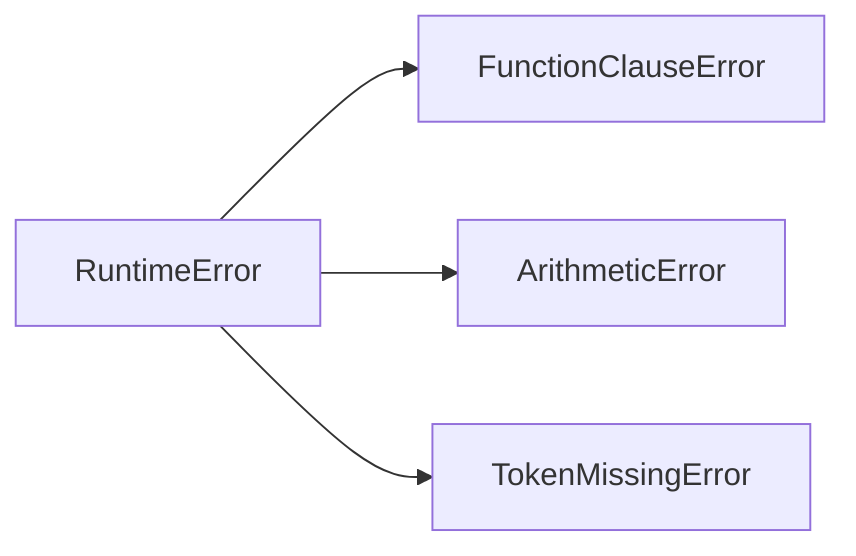

<!-- livebook:{"break_markdown":true} -->

### Try/Rescue

When executing code that could result in an error, you case use `try` and `rescue` to prevent it from crashing
the entire program's execution. The code in the `try` block will run, and if it results in an error,
then the `rescue` block will run. the `rescue` block works like a `case` statement where you can
pattern match on the error from the `try` block.

```elixir
try do
  raise "oh no!"
rescue
  _ -> "that's better"
end
```

In the above example we pattern match using the default case with underscore `_`.
You could instead match on the specific error **RuntimeError**

```elixir
try do
  raise "oh no!"
rescue
  RuntimeError -> "that's better"
end
```

In fact, you have the ability to decide which type of error to `raise`.

```elixir
try do
  raise ArithmeticError, "Math can be hard sometimes"
rescue
  ArithmeticError -> "Fortunately you have support!"
end
```

It's convention in Elixir to use bang `!` in the name of a function that expects to raise an error.
For example, there's an alternative to `Date.new/4` called `Date.new!/4`. Instead of returning an
`:ok` or `:error` tuple it either returns a date, or raises an error.

```elixir
Date.new!(1982, 06, 29)
```

```elixir
Date.new!(11982, 06, 29)
```

### Your Turn

<!-- livebook:{"break_markdown":true} -->

In the Elixir cell below, `raise` a **TokenMissingError**

```elixir

```

In the Elixir cell below

* Create a `try`/`rescue` block.
* Cause a **SyntaxError** in the try block.
* Handle the **SyntaxError** in the rescue block and return `"phew!"` .

```elixir

```

## Testing Performance

While theoretical performance is important, in practice it's best to test your assumptions.

There are a wide variety of tools that allow you to test performance.

You can use the built-in Erlang library `:timer`'s `tc/1` function to measure the time it takes
to run a function in milliseconds.

```elixir
{time, _result} = :timer.tc(fn -> 100 ** 1_000_000 end)
time
```

In practice, we'll usually lean on a library to test performance. The **Benchee** library allows
us to check multiple function's performance and memory usage.

```elixir
list = Enum.to_list(1..100)
tuple = List.to_tuple(list)

test =
  Benchee.run(
    %{
      "list" => fn -> Enum.at(list, 50) end,
      "tuple" => fn -> elem(tuple, 50) end
    },
    time: 1,
    memory_time: 2
  )

Kino.nothing()
```

## Linked Lists

# Installing Libs
### Benchee

[Benchee](https://github.com/bencheeorg/benchee)
is a popular library for measuring performance and memory consumption.

External libraries need to be installed to use them.

We use [Mix](https://hexdocs.pm/mix/1.13/Mix.html) to install Benchee.

[Mix](https://hexdocs.pm/mix/1.13/Mix.html)  is a build tool that provides tasks for creating, compiling, and testing Elixir projects, managing its dependencies, and more.

<!-- livebook:{"break_markdown":true} -->

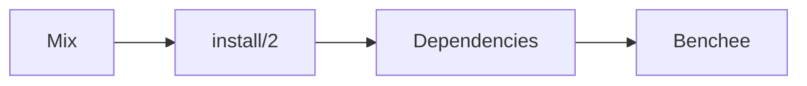

```elixir
Mix.install([{:benchee, "~> 1.0"}])
```

External libraries often have different versions, so we need to specify the version of the project we'd like
to use.

```mermaid
flowchart
  0[0.98]
  1[0.99]
  2[1.00]
  3[1.01]
  B[Benchee]
  M[Mix]
  M --> B
  B --> 0
  B --> 1
  B --> 2
  B --> 3
```

<!-- livebook:{"break_markdown":true} -->

We can use the `Benchee.run/2` function to measure the performance and memory consumption of some code.

```elixir
Benchee.run(
  %{
    "example test" => fn -> 10000 ** 10000 end
  },
  time: 10,
  memory_time: 2
)
```

## Proving Shallow Copies are the same structure.
Now, let's prove this to be true. We can use the `:erts_debug.same/2` function from Erlang to
prove if two values are the same in memory. This is for demonstration purposes only, it's rare that 
you would need to rely on this function.

<!-- livebook:{"break_markdown":true} -->

Primitive data types like `1` are sometimes called **immediate values**. They are written
directly into the instruction rather through a reference or pointer. This means that `1` is the same
value as `1`.

```elixir
:erts_debug.same(1, 1)
```

```elixir

```

Non-immediate values are understood by the computer through a reference or pointer. This means 
that non-immediate values such as `[1]` are not identical.

```elixir
:erts_debug.same([1], [1])
```

We can however, prove that a shallow copy of some data structure is the same underlying data.
Here we can prove that when two variables contain the matching non-immediate values they are not the
same data structure.

```elixir
a = [1]
b = [1]
:erts_debug.same(a, b)
```

And when we instead assign `b` to reference `a` they do share the same non-immediate data structure.

```elixir
a = [1]
b = a
:erts_debug.same(a, b)
```

`a` in `a_tuple` and `a` in `new_tuple` share memory. This means they are structurally identical, 
and we can prove it.

```elixir
{a1, b1, c1} = a_tuple
{a2, b2, c2} = new_tuple
:erts_debug.same(a2, a1)
```

```elixir
:erts_debug.same(a2, a1)
```

### Shallow Copying Lists

<!-- livebook:{"break_markdown":true} -->

Elements prior to the modification in the list will be shallow copied.

Let's prove that
by updating a list and using `:erts_debug.same/3` to show that elements prior to the modification
are shared.

```elixir
a = {1, 2, 3}
b = {4, 5, 6}
c = {7, 8, 9}
b2 = {10, 11, 12}

# New_list shallow copies a from a_list and reuses c.
a_list = [a, b, c]
new_list = List.replace_at(a_list, 1, b2)

# The first element in new_list is a shallow copy of the first element in a_list.
# This means that the first element in both lists is structurally identical.

# true = :erts_debug.same(List.first(a_list), List.first(new_list))
# false = :erts_debug.same([a], [a])
# false = :erts_debug.same(Enum.take(a_list, 1), Enum.take(new_list, 2))
true = :erts_debug.same(Enum.drop(a_list, 2), Enum.drop(new_list, 2))
```

```elixir
:erts_debug.same({1, 2, 3}, {1, 2, 3})
```

```elixir
Enum.take([1, 2], 1)
```

We can also prove that the tail of the list is reused.

```elixir
:erts_debug.same(List.last(a_list), List.last(new_list))
```

### Charlists
You may notice that sometimes your list of integers will print as a strange character. Notice
that the final element in the following is a `'-\n'` rather than the expected `[45, 10]`

```elixir
list =
  for a <- 1..45, b <- 1..10, rem(a, 15) === 0, rem(b, 5) === 0 do
    [a, b]
  end
```

That's because internally Elixir represents lists of integers as [Charlists](reading/charlists.livemd).
However, if you use the list again, you'll see that `'-\n'` still represents `[45, 10]` internally.

```elixir
Enum.map(list, fn [a, b] -> {a, b} end)
```

# Performance
### Your Turn

Evaluate the Elixir cell below to view the exercise.

````elixir
# TODO - Hide
Kino.Input.text("What is the Big O Notation for the following?") |> Kino.render()

Kino.Markdown.new("
```elixir
1 + 1
```
") |> Kino.render()

# TODO - Hide
Kino.Input.text(
  "As elements are added to the `map`, what is the Big O Notation for the following?"
)
|> Kino.render()

Kino.Markdown.new("
```elixir
map = %{key: \"value\"}
map.key
```
") |> Kino.render()

Kino.Input.text(
  "As elements are added to `list`, what is the Big O Notation for the following code?"
)
|> Kino.render()

Kino.Markdown.new("
```elixir
list = [1,2,3]
Enum.map([1, 2, 3], fn each -> each  + 2 end)
```
") |> Kino.render()

Kino.Input.text(
  "As elements are added to `list`, what is the Big O Notation for the following code?"
)
|> Kino.render()

Kino.Markdown.new("
```elixir
list = [1,2,3]
Enum.map([1, 2, 3], fn element1 -> 
  Enum.map(list, fn element2 -> {element1, element2} )
end)
```
")
````


C1[1]

C11[1]
C12[2]
C13[3]

C1 --> C11
C1 --> C12
C1 --> C13

C111[1]
C112[2]
C113[3]

C11 --> C111
C11 --> C112
C11 --> C113

C121[1]
C122[2]
C123[3]

C12 --> C121
C12 --> C122
C12 --> C123

C131[1]
C132[2]
C133[3]

C13 --> C131
C13 --> C132
C13 --> C133


# File
We'll focus on using `:read` to allow us to read the contents of the file, and `:write` to allow us
to write content to the file. Next we provide a callback function to execute before closing the connection
to the file.
* [Shopping List](exercises/currated_shopping.livemd) (create shopping items)
* [Save Game State](exercises/save_game_state.livemd)
* * [User Form](exercises/user_form.livemd)
* 
* [Pokemon PC](exercises/pokemon_pc.livemd)

### How to install a utils folder!

Mix.install([
  other_deps,
  {:db_utils, path: Path.absname("db_utils")}
])

### How to icon
<i class="ri-livebook-sections"></i

# Box Animation
```elixir
defmodule Kino.BoxAnimation do
  @moduledoc """
  Box Animation was an attempt to improve the :eager_evaluation and :lazy_evaluation animation
  Unfortunately it caused jittering on each load. In the future, it would make sense to move the logic from Utils.animate
  to this component.
  """

  use Kino.JS

  @deprecated
  def new(rows) do
    Kino.JS.new(__MODULE__, rows)
  end

  asset "main.js" do
    """
    function box(children) {
      return `<div class="box">${children || ""}</div>`
    }
    function green_box(children) {
      return `<div class="box box--green">${children || ""}</div>`
    }
    function grey_box(children) {
      return `<div class="box box--grey">${children || ""}</div>`
    }
    function row(title, items) {
      return `<div class="row">
       <p class="row__title">${title}</p>
       <div class="row__items"">${items.join("")}</div>
     </div>`
    }
    function to_box(box_data) {
      switch (box_data.color) {
        case "green":
          return green_box(box_data.text)
        case "grey":
          return grey_box(box_data.text)
        default:
          box(box_data.text)
      }
    }
    export function init(ctx, rows_data) {
      ctx.importCSS("main.css");
      rows_data.forEach(row_data => {
        ctx.root.innerHTML += row(row_data.title, row_data.boxes.map(to_box))
      })
    }
    """
  end

  asset "main.css" do
    """
    .row {
      height: 80px;
      display: flex;
      width: 100%;
      align-items: center;
    }
    .row__title {
      font-weight: bold;
      font-size: 24px;
      margin: 0;
      width: 10%;
    }
    .row__items {
      display: flex;
      width: 90%;
    }

    .box {
      margin: 0 10px;
      font-size: 24px;
      font-weight: bold;
      height: 50px;
      width: 50px;
      display: flex;
      align-items: center;
      justify-content: center;
    }
    .box--green {
      background-color: #D5E8D4;
      border-color: #82B366;
    }
    .box--grey {
      background-color: #F5F5F5;
      border-color: #666666
    }
    """
  end
end
```

(Supervise workers that harvest resources on an interval, Task Supervise special workers)
(Reset Bomb Timer By Killing Process)
(Randomly Generate Simple Math Questions, restart timer upon correct answer)
   * Override Macros to allow using + with lists and other data types. `use` the module to inject `FlexibleMath`.
   Code Clarity, Mix Testing Tools (--slowest, --stale, tags, Elixir Test extension)

### Assessment & Review
Assessment will provide the teacher an understanding of how students incorporated the learning from the
previous interactive instruction, and will provide reactive lectures based on what students require more
instruction in. Review will provide the students an opportunity to recall prior information and review
any topics that require it.

### Introductory Lecture
In general the academy follows a flipped-classroom format where students will be given interactive livebook material to study during the **Reading & Support** time. However, an introductory lecture will be given to provide an overview of the day's goals and tie larger picture concepts together.

### Exercises
Students will perform Exercises which generally build in complexity and incorporate more advanced application of previously studied topics. Some exercises will be a guided follow along, some will 


## Class time

Class time will be broken into
1. **Assessment & Review**
2. **Introductory Lecture**
3. **Exercises**
4. **Reading & Support**

### Grading
Students will not receive a number or letter grade for this course. Due to the nature of the assignments,
this course will be completion-based and rely on the intrinsic motivation of learning and self-improvement rather than carrot and stick motivation.

For more on this see [Mark Rober's Talk](https://www.youtube.com/watch?v=9vJRopau0g0&ab_channel=TEDxTalks).

### Recover after a commit

If you create a commit with some undesired changes fixing them can be a bit harder.

To avoid losing work, it's best to reach out to your teacher to ensure you fix this issue safely.

However, this is a common problem when doing development, so we'll practice it now.

First, ensure you don't have any active changes.

```
$ git status
On branch main
Your branch is up to date with 'origin/main'.

nothing to commit, working tree clean
```

If you have changes, stage and commit them first.

```
$ git add .
$ git commit -m "add latest changes"
```

Now delete the content in the following Elixir cell.

```elixir
"delete me and recover me!"
```

Stage and commit this change.

```
$ git add .
$ git commit -m "remove elixir cell for livebook exercise"
```

Now you can use `git log` to view all of your commits.

```
$ git log
commit 27131ad551555c1a89c7df1b0c4fd647f2dbc346 (HEAD -> main, origin/main, origin/HEAD)
Author: USER <email@gmail.com>
Date:   Mon Mar 28 21:51:16 2022 -0700

    remove elixir cell for livebook exercise

commit 2d4b114519ae5db57c5fa2b8ace055e0a71c8b7a
Author: USER <email@gmail.com>
Date:   Mon Mar 28 21:48:26 2022 -0700

    add latest changes
```

You can then use `git checkout` to set the current local branch back to a previous commit.
Replace `2d4b114519ae5db57c5fa2b8ace055e0a71c8b7a` with the value displayed for your `add latest changes`
commit.

```
$ git checkout 2d4b114519ae5db57c5fa2b8ace055e0a71c8b7a
c8b7a
Note: switching to '2d4b114519ae5db57c5fa2b8ace055e0a71c8b7a'.

You are in 'detached HEAD' state. You can look around, make experimental
changes and commit them, and you can discard any commits you make in this
state without impacting any branches by switching back to a branch.

If you want to create a new branch to retain commits you create, you may
do so (now or later) by using -c with the switch command. Example:

  git switch -c <new-branch-name>

Or undo this operation with:

  git switch -

Turn off this advice by setting config variable advice.detachedHead to false

HEAD is now at 2d4b114 add new file content
```

You'll also see some patterns for this course. For example, many notebooks will have a
**Setup** section with the following Elixir code.

```elixir
Mix.install([
  {:kino, github: "livebook-dev/kino", override: true},
  {:kino_lab, "~> 0.1.0-dev", github: "jonatanklosko/kino_lab"},
  {:vega_lite, "~> 0.1.3"},
  {:benchee, "~> 0.1"},
  {:ecto, "~> 3.7"},
  {:math, "~> 0.7.0"},
  {:faker, "~> 0.17.0"},
  {:utils, path: "utils"}
])
```

This Elixir code installs some tools used in the notebook. You can generally ignore it and
do not need to understand it yet.

## Side Effects (Reading)

Since you are working with a persistent file system, it's possible to have persistent
side-effects that affect your tests. For example, files may already exist.

To avoid this issue, it's often wise to cleanup (delete) any files you create before or after your tests.

If you find this code repetitive, you may consider putting it into a `setup` function like so:

<!-- livebook:{"break_markdown": true} -->
```elixir
# journal_test.exs
setup do
  File.rm_rf("test_entries")
  :ok
end
```

You can use `on_exit/2` to run the code after the test rather than before it.

<!-- livebook:{"break_markdown": true} -->
```elixir
# journal_test.exs
setup do
  on_exit(fn -> File.rm_rf("test_entries") end)
end
```

### Journal
```elixir
  test "main/1 with --tags creates Yaml formatted tags" do
    Journal.main(["--tags", "tag1,tag2,tag3"])
    assert {:ok, content} = File.read(@file_path)

    assert content ==
             "---\ntags: ~w(tag1 tag2 tag3)\n---#{@file_content}"
  end

  test "main/1 search --tag command finds files with matching tags" do
    Journal.main(["--tags", "tag1,tag2,tag3", "--title", "tagged_article"])
    Journal.main(["--title", "untagged_article"])

    logs =
      capture_log(fn ->
        Journal.main(["search", "--tags", "tag1"])
      end)

    assert logs =~ "tagged_article.md"
    refute logs =~ "untagged_article.md"
  end
```


### Pokemon Simulator

In the Elixir cell below, bring all of the prior functionality into a single
`Pokemon` module.

* Define a `Pokemon` struct the same as before.
* add the named functions `attack/2` and `battle/2`.
* set `@charmander`, `@bulbasaur`, and `@squirtle` as module attributes.
* create a `simulate/2` function that takes in two pokemon names as strings `"Bulbasaur"`, `"Squirtle"`, or `"Charmander"`.
* make the pokemon `battle/2` each other three times. Ensure that you use the updated pokemon structs in the next battle.
* if both pokemon still have health, return `"it's a draw"`
* if one pokemon has less than 1 health, return `"#{pokemon.name} wins!"`

```elixir

```
