Under the hood, computers store information as electrical signals, either `on` or `off`, `0` or `1`.
So you might wonder, how are they able to represent numbers larger than 1?

Fortunately, humans have been thinking about base 2 counting systems since the days of ancient
Egypt. The current binary counting system was created by [Gottfried Wilhelm Leibniz](https://www.inverse.com/article/46587-gottfried-wilhelm-leibniz-binary-system)
In the 17th Century.

What's a base 2 counting system? Well first, let's take a second to appreciate that we have a
base 10 counting system. We have ten digits, and use placeholders to represent shifting values.

```
1 2 3 4 5 6 7 8 9 0
```

Early computers were built to perform mathematical calculations. Therefore it's necessary
to be able to represent an entire number system. We use **Integers** to represent whole positive or negative
numbers. `100` is an integer, `0` is an integer, and so is `-10`.

Take the example number `4762`. It has

* `4` thousands
* `7` hundreds
* `6` tens
* `2` ones

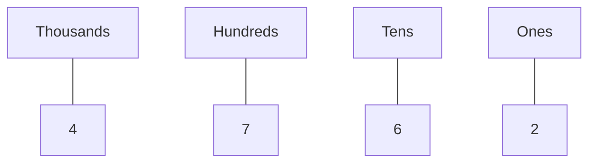

### Counting  Visualization

<!-- livebook:{"break_markdown":true} -->

To help you visualize counting in a base10 system, Here's a visualization of 4 placeholders.
You have your ones, tens, hundreds, and thousands.

Evaluate the elixir cell below to visualize how numbers shift to the left placeholder as you count.

````elixir
## TODO - Hide

Kino.animate(500, 0, fn i ->
  digits = Integer.digits(i)
  reverse_digits = Enum.reverse(digits)
  ones = Enum.at(reverse_digits, 0)
  tens = Enum.at(reverse_digits, 1)
  hundreds = Enum.at(reverse_digits, 2)
  thousands = Enum.at(reverse_digits, 3)
  md = Kino.Markdown.new("
  ```mermaid
  flowchart
  Thousands --- TH[#{thousands || 0}]
  Hundreds --- H[#{hundreds || 0}]
  Tens --- T[#{tens || 0}]
  Ones --- O[#{ones || 0}]
```
")

  # performant_alternative = [thousands || 0, hundreds || 0, tens || 0, ones]

  {:cont, md, rem(i + 1, 9999)}
end)
````

Now, a base 2 counting system works on the same principle as a base 10, except we
only have 2 digits to represent numbers with.

```
0 1
```

Everytime we run out of digits, we shift the placeholder over.

Take the example binary number `1011` which is eleven in base10. It has

* `1` eight
* `0` four
* `1` two
* `1` one

It's eleven, because `8 + 2 + 1 = 11`.

You can see how our base10 numbers are represented as binary in this table.

```elixir
# TODO - Hide

data =
  Enum.map(1..500, fn integer ->
    binary = Integer.digits(integer, 2) |> Enum.join() |> String.to_integer()
    %{base10: integer, base2: binary}
  end)

Kino.DataTable.new(data)
```

### Counting Binary Visualization

Want to see binary counting in action?
Evaluate the Elixir cell below to see an animation.

````elixir
# Todo - Hide

Kino.animate(1000, 0, fn i ->
  digits = Integer.digits(i, 2)
  reverse_digits = Enum.reverse(digits)
  ones = Enum.at(reverse_digits, 0)
  twos = Enum.at(reverse_digits, 1)
  fours = Enum.at(reverse_digits, 2)
  eights = Enum.at(reverse_digits, 3)
  sixteens = Enum.at(reverse_digits, 4)
  thirtytwos = Enum.at(reverse_digits, 5)
  sixtyfours = Enum.at(reverse_digits, 6)
  hundredtwentyeights = Enum.at(reverse_digits, 7)

  md = Kino.Markdown.new("
  ```mermaid
  flowchart
  Integer[#{i}]
  HundredAndTwentyEights --- 128[#{hundredtwentyeights || 0}]
  SixtyFours --- 64[#{sixtyfours || 0}]
  ThirtyTwos --- 32[#{thirtytwos || 0}]
  Sixteens --- 16[#{sixteens || 0}]
  Eights --- 8[#{eights || 0}]
  Fours --- 4[#{fours || 0}]
  Twos --- 2[#{twos || 0}]
  Ones --- 1[#{ones || 0}]
```
")

  # performant_alternative = ([0, 0, 0, 0, 0, 0, 0, 0, 0, 0] -- Enum.map(0..length(digits), fn _ -> 0 end)) ++ digits
  max = 128 + 64 + 32 + 16 + 4 + 2 + 1
  {:cont, md, rem(i + 1, max)}
end)
````

This is how despite only having `on` and `off`, `0` and `1` computers are able to
represent large numbers.

You'll notice that in the above animation we show eight placeholders. That's because binary
digits are grouped together in eights. each digit is called a **bit**, and each grouping of eight
is called a **byte**.

<!-- livebook:{"break_markdown":true} -->


As we count from 1 to 9, we then add a 1 in the placeholder on the left, and restart at 0.
You probably do this intuitively. This means we have placeholders for **ones**, **tens**, **hundreds**, etc.

The base10 counting system shouldn't be taken for granted. Humans have been intellectually
capable of creating a base10 counting system for over 200000 years, and yet our current
system was only invented in the 7th century. 🤯

Can you imagine if we had different symbols for every number? 
It would be impossible to remember.

## CodePoints


### How did we go from Integers to Strings?

You might wonder how we went from representing integers to representing strings and 
any valid text character.

Essentially, characters have an equivalent integer associated with them. 
This integer is called a **code point**.

For example, the code point for the letter `a` is `97`. Lowercase and uppercase letters have
different codepoints.

You can find the code point of any character by using `?` in Elixir. Evaluate the Elixir cell below
to see how `?a` returns `97`.

```elixir
?a
```

Once again, while it's useful to be aware of how strings are represented by the computer. 
it's not crucial to understand for most purposes.

If you are curious, the full list of representable characters is called the [The Unicode Standard](https://unicode.org/standard/standard.html).
below is a table of code points for uppercase and lowercase letters in the 
alphabet.

You do not need to memorize these values! The goal of this lesson is simply awareness.

```elixir
# TODO - hide

"ABCDEFGHIJKLMNOPQRSTUVWXYZabcdefghijklmnopqrstuvwxyz"
|> String.codepoints()
|> Enum.map(fn char ->
  <<code_point::utf8>> = char
  %{character: char, code_point: code_point}
end)
|> Kino.DataTable.new()
```

In the Elixir cell below, enter the codepoint for the letter `"Y"`. You're allowed to use `?`!

# Tuples


### Lists vs Tuples

You might notice that tuples and lists seem very similar, and they are. They are both
data types that contain a collection of elements.

The major difference is performance. Both are good at different things. In Elixir,
it's fast to retrieve an element from a tuple, however it's slow to add a new element in.

Why? Well, that requires some understanding of how memory works in a computer.
The short version is that a tuple is stored continuously all together. So, you know where
each element is on the computer.

<!-- livebook:{"break_markdown":true} -->

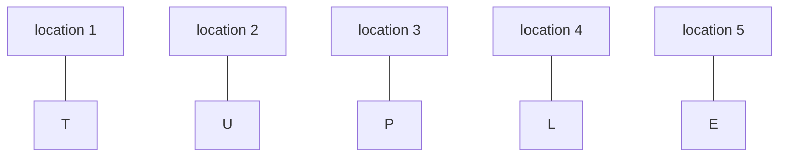

<!-- livebook:{"break_markdown":true} -->

However, if you want to add a new element in that means you have
to move the location of every element.

Lists on the other hand have the opposite strengths and weaknesses. Lists are stored
as **linked-lists** which means each element in the list knows the location of the next element.

<!-- livebook:{"break_markdown":true} -->

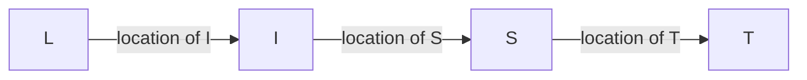

<!-- livebook:{"break_markdown":true} -->

So we can store elements in a list anywhere, if we need to add or remove a new element
we only have to change the location one element is pointing to.

However, we don't know the location of every element upfront like with a tuple, so if you
want to get the third element, you need to look through the first and second to find it.

## Comparison Operators
Comparison operators are not limited to comparing integers and floats. For example, they are often used to compare the equality of other data types.

```elixir
"hello" === "hello"
```

```elixir
%{hello: "world"} === %{hello: "world"}
```

```elixir
["hello", "world"] === ["hello", "world"]
```

## Booleans
Programming languages hide the internal details of how computers work. This allows us as
developers to think at a high level. However, it's still useful to be aware of some of the inner workings.

Under the hood, computers store electrical signals. You can think of this like powering a 
lightbulb but on a much smaller scale. An electrical signal is either **on** or **off**, and by manipulating
these electrical signals, we are able to create complex information and instruction.

You may have seen movies or tv series that show coding as a bunch of `1`s and `0`s
. A 0 represents a signal that's **off** and a `1` represents a signal
that's **on**. These `0`s and `1`s are called **binary**.

After we write our Elixir code, our instructions are then converted or **compiled** into binary.
**binary** is the machine code that the computer actually understands.

So, you might wonder how we go from `0`s and `1`s to creating rockets, websites, self-driving
cars, smartphones, and 3D animations.

Well let's take the first step with booleans. A boolean (BOO-LEE-AN). 
is a `true` or a `false` value. Conceptually, this is a direct representation of
`on` and `off` in your program.

There are only two booleans.

## Control Flow Overview
* **Pattern matching** with the **match operator**
* Using `with` to check a series of conditions before entering a path.
* using **Multi-clause functions** with **pattern matching**
* Handling errors with the :ok, and :error tuple and **pattern matching**

## Enum
Which means you can also use pattern matching on the elements in a map.

```elixir
Enum.map(%{key: "value"}, fn {_key, value} -> value end)
```


Map keys can still be any type in the tuple.

```elixir
Enum.map(%{%{} => "value"}, fn {key, _value} -> key end)
```

You can use pattern matching inside of the function.

```elixir
Enum.map([one: 1], fn {_key, value} -> value end)
```

## WHy use polymophism
### Why Use Polymorphism?

Instead of specific constructs that enable polymorphism, 
you can instead use control flow constructs like `if`, `cond`, and `case` to
alter the behavior of your programs.

Often though, we use polymorphism to improve the clarity of your code where `if`, `cond`, and `case`
would become less clear. For example, let's say we don't use polymorphism with multiple arity functions
and instead write a single function with a list for the parameter.

We'd need to check the length of names with `length/1`,
and retrieve each element in the list.

```elixir
defmodule Greeter do
  def hi(names) do
    case length(names) do
      1 -> "Hi #{Enum.at(names, 0)}!"
      2 -> "Hi #{Enum.at(names, 0)} and #{Enum.at(names, 1)}!"
      _ -> "Hi everyone!"
  end
end
```

Is it better or worse? It's not always clear-cut, but it's useful to
rely on polymorphism when it would improve the clarity of your code.

## Lesson 2: Operators

## Setup

Ensure that you evaluate all code using the `ea` keybinding. Press the `e` then the `a` key.

```elixir
Mix.install([{:kino, github: "livebook-dev/kino"}])
```

## Overview

You can think of all programming as split into data and behavior. In the previous lesson,
you learned all about data, and in this lesson, you're going to learn about behavior.

### Operators

To operate means to control a machine, process, or system.
Thus we have **operators** which control the behavior of our program.

In this lesson, you're going to learn:

* **Arithmetic operators** performing mathematical operations. `+`, `-`, `*`, `/`, `div`, and `rem`
* **Match operator** binding data to a variable. `=`
* **Comparison operators** comparing values to one another. `===` `==` `>=` `<=` `<` `>`
* **Boolean operators** comparing booleans and truthy values. `and` `or` `not` `&&` `||` `!`
* **String operators** manipulating strings. `<>`, `#{}`
* **List operators** manipulating lists. `++` `--`
* Accessing map values with **map.key** notation and **map[key]** notation.


## Combining Operators

So far, you've only used operators in isolation. But it's important to remember that you
can use them in combination.

```elixir
2 + 3 > 4
```

```elixir
"4 + 7 is greater than 8 and 2 + 10 is less than 20: #{4 + 7 > 8 && 2 + 10 < 20}"
```

### Your Turn: Min Max Program

Here's a small program that checks if a variable is between two integers.

You'll notice that code can include line breaks to make it easier to read.

Try setting `input` to `15` to see it return. `"15 is between 10 and 20"`.

```elixir
input = 5
max = 20
min = 10

(input < max && input > min &&
   "#{input} is between #{min} and #{max}") || "#{input} is outside #{min} and #{max}"
```

### Your Turn: Rock Paper Scissors

In the Elixir cell below, You're going to create the perfect AI for rock paper scissors.
You should only need to use `&&`, `=`, `===`, `||` operators.

* Create a variable `input` and bind it to `"Rock"`.
* Use **comparison** operators to check if input equals "Rock" then return "Paper"
* Bonus: handle if input equals "Paper" then return "Scissors"
* Bonus: handle if input equals "Scissors" then return "Rock"

```elixir

```

## Syntax Errors

`Syntax` refers to the keywords and symbols you use to provide instruction to the computer through
Elixir. If you do not follow the rules that Elixir sets, your code will not
compile into instructions for the computer, and you will see a red `error` message.

Sometimes your code is valid, but you may still see a yellow `warning`. Warnings let you know
that you might be making a mistake in your program, but the code still compiles into valid
instruction.

In general, in programming, you have to be precise. A single misplaced character causes your entire
program to stop working!

Take care to regularly evaluate any code you're writing to ensure
it compiles. Regularly verifying your code compiles makes it a lot easier to know if a 
change triggered an error or warning.

Elixir does it's best to let you know the cause of your error, but it can take some time to get used to reading these messages.

For example, here's the error messages you receive when you have a dangling operator without a 
value on the right-hand side.

```elixir
2 *
```

In general, errors will provide you an **error type**, **error message**, **line number**, 
and even the **code causing the crash**

Here's what the error above tells us.

* **Error type**: **TokenMissingError** because we're mising the next token 
  (in this case a number) in the `2 * number` expression.
* **Error message**: `syntax error: expression is incomplete `
* **Code causing the crash**:
  ```elixir
    |
  1 | 2 *
    |   ^
  ```
* **Line number**: the crash is on **line 1**

### Your Turn

In the Elixir cell below, Reproduce a crash by writing `"hello" <>`.
Then, try using `Enter` to create a new line and shift the code down to **line 2**. See how the 
error is different now.

```elixir

```

# Modules and Functions

## Setup

```elixir
require Integer
```

## Overview

You're about to unleash the full power and potential of programming.

Data structures and operators are fundamental for providing instructions 
to the computer, but you're limited in how repeatable and reusable those
instructions can be.

For example, if you want to determine if many numbers are even, you must repeatedly reimplement that behavior.

Reusing repeatable instructions makes programming far more powerful. 
This is because each solved problem acts as a building block for the next.

### Abstractions

To abstract in our context means to reduce complexity by hiding implementation details.

You work with abstractions all the time. For example, it was mechanical and complex when you first learned to walk. Now you move without even thinking about it.

Any machine you operate is an abstraction. Do you drive? You've probably
never needed to think about the complex machinery triggered by turning a wheel. How about typing? That's right. Your keyboard is an abstraction for the complex electrical signals required to communicate with your computer.

Human beings have limited brains, so we deal with complexity by creating abstractions.

### Breaking Down Problems

In programming, we rely on abstractions in much the same way. We figure out how to solve small 
problems, and then we reuse those small abstractions to solve more significant challenges.

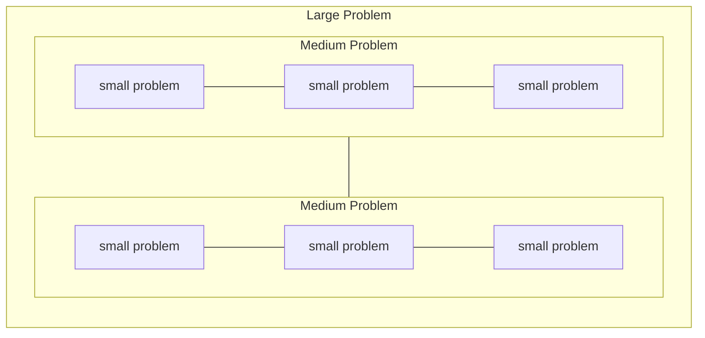

### How do we Build Abstractions?

**Modules** and **functions** are the primary tools
we have to create abstractions and repeat behavior.

In total this lesson will cover:

* How to abstract away implementation details with **functions**.
* How to create **multi-parameter functions** accept multiple inputs.
* An alternative **shorthand syntax** for functions.
* How we can use **first-class functions** as values in **higher-order functions**
* How to group functions in a **module**.
* **Private** and **public** functions in a module.
* Using **module attributes** to create reusable constant valuse between module functions.
* How to achieve **polymorphism** with **multiple function clauses**.
* How to compose functions together using the **pipe operator**.
* Validating function input with **guards**.

## Functions

Elixir is a Functional programming language. So you can imagine that Functions must be important. But what is a function?

### Input and Output (IO)

A function is a set of repeatable instructions. A function accepts some **input**, and returns
some **output**.

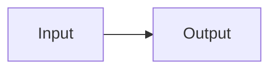

### Black Box

How the function converts some input to some output is often referred to as a **black box**.
It's a black box because you don't need to know (or can't know) the details of how it works.

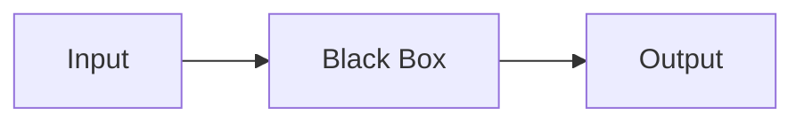

### Creating a Function

Let's create a function called `double` which will take in a number and
double its value.

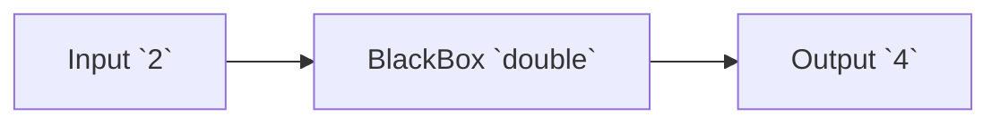

Now, let's create our first function. At first, it's going to do nothing.
A function must have an output. We can return `nil` for now.

```elixir
double = fn -> nil end
```

You may see some weird-looking output like `#Function<45.65746770/0 in :erl_eval.expr/5>`.
Don't worry too much about that. It's how Elixir represents a function internally.

### Parts of a Function

Let's break down what we did above.

1. `double` is a variable name. Often you'll refer to it as the **function name**. 
   It can be any valid variable name.

2. We bind `double` to an **anonymous function**.
   The anonymous function is everything from the `fn` to the `end`.

   ```mermaid
   flowchart LR
    A[function name] --> B[=]
    B --> C[anonymous function]
   ```

3. Elixir uses the `fn` keyword to define a function.

4. The next value `->` separates the **function head** and the **function body**.

5. The **function head** describes the input of the function. In this example, it's empty.

6. The **function body** contains the function's implementation or **black box** . In this example, it returns `nil`.

7. Elixir uses the `end` keyword to stop creating a function.

<!--  -->

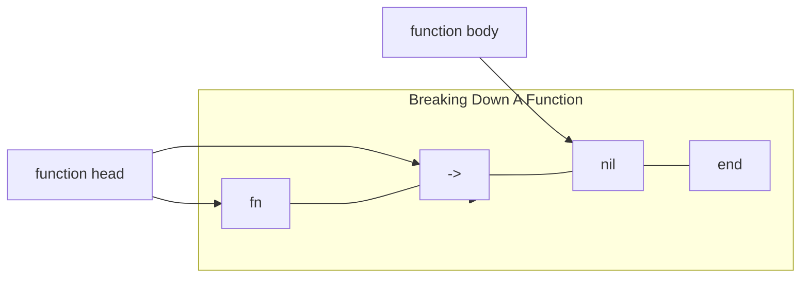

### Calling a Function

Our `double` function doesn't do much at this point, but let's see the **output** that it returns.

We use the `.()` syntax in Elixir to get the function's output. We often say we are **executing** or **calling** a function.

```elixir
double.()
```

`double` should return `nil` because that's all we've told it to do so far. However, we want
it to multiply a number by `2`.

To do that, we need to make the function accept some input. To do this,
we define a **parameter** in the function like so.

```elixir
double = fn parameter -> nil end
```

You'll notice a warning above. That's because Elixir is smart and lets us know that we've
created a parameter, but we're not using it. In Elixir, if you want to have an unused variable
without warning, you can mark it with an underscore `_`

```elixir
double = fn _parameter -> nil end
```

No more warning 😀 But we actually want to use that parameter, so let's 
modify the function to return the parameter instead.

```elixir
double = fn parameter -> parameter end
```

The parameter is named parameter here for the sake of example. But it works a lot like a variable, and it can be named anything.
Let's rename it to `number` to clarify what we expect the input to the function to be.

```elixir
double = fn number -> number end
```

Now the function head takes in a value. We have to pass it
an **argument**when we call it. The argument is binded to the parameter when the function 
executes. We'll give it the integer `2`.

```elixir
double.(2)
```

Under the hood, when the function runs, the parameter is binded to the argument's value.

Step by step, that would look like this.

<!-- livebook:{"force_markdown":true} -->

```elixir
double = fn number -> number end
double.(2)
fn 2 -> 2 end
2
```

<!-- livebook:{"break_markdown":true} -->

Notice that if you try to call the function without an argument, it fails because
it expects an argument. Not all languages do that, but Elixir is pretty smart 😎

```elixir
is_even.()
```

Great, now all that's left is to multiply the parameter by `2`. You should be familiar with 
this from the previous sections.

```elixir
double = fn number -> number * 2 end
```

And you can use it to double any number.

```elixir
double.(10)
```

```elixir
double.(11)
```

```elixir
double.(10 ** 2 - 1)
```

### Implied Return Values

Some languages require explicit return values.

However, in Elixir the output of a function is always the last line.

For example, notice that the return value below is `first` + `second`, which equals `3`.

```elixir
multiline_function = fn ->
  first = 1
  second = 2
  first + second
end

multiline_function.()
```

## Multi-Parameter Functions

Functions can accept multiple inputs. Separate parameters with commas `,` to create a multi-parameter function.

Let's say you're creating a function `calculate_force`, which will take in `mass` and
`acceleration`. (remember that force = mass * acceleration)

Let's start with the `double` function and see how we could convert it into a `calculate_force` function.

```elixir
double = fn number -> number * 2 end
```

First, let's rename `double` to `calculate_force` and rename `number` to `mass`. That gets us
most of the way there!

```elixir
calculate_force = fn mass -> mass * 2 end
```

Technically, we've got a function that calculates the force of an object with a given mass and
an acceleration of 2.

However, we want it to be truly reusable, so we need to figure out how to replace 2 with another
parameter. You can declare a function that accepts multiple parameters by separating them with a 
comma `,` as you do in a list or tuple.

```elixir
calculate_force = fn mass, acceleration -> mass * acceleration end
```

That should be working! Now you can call the function by passing in two arguments the same way.

```elixir
calculate_force.(10, 2)
```

Keep in mind that the first argument will be the value of the first parameter, and the second argument
will be the value of the second parameter. You can repeat this with as many parameters as you want!

```elixir
example = fn a, b, c, d, e -> [a, b, c, d, e] end

example.(1, 2, 3, 4, 5)
```

But usually, you want to avoid having too many parameters because it makes your function hard
to understand.

A parameter can be bound to any valid data type, so you could instead use associative data
a structure like a map or keyword list.

```elixir
is_even = nil
```

## Shorthand Syntax

Anonymous functions can be defined using a shorthand syntax. It is only an alternative and shorter
version to define a function. You will sometimes see shorthand syntax, so it's helpful to understand it.
However, it should not be over-used. Otherwise, your program may be less clear.

You can still bind the anonymous function to a variable with the shorthand syntax.
However, you define the function with `&()` and put the function body between the brackets.

Here's the same `double` function using short-hand syntax.

```elixir
double = &(&1 * 2)
double.(5)
```

`&1` means the first parameter. If the function had more parameters, you could access them with `&2`, `&3`, and so on.

```elixir
add_two = &(&1 + &2)
add_two.(2, 3)
```

### Function Arity

The number of parameters your function accepts is called the `arity` of the function.

A function with no parameters has an arity of zero. A function with one parameter has
an arity of one, and so on.

You refer to the function as `function_name/arity` thus a function named `add_two` with two parameters
is called `add_two/2`.

## First-class Functions

Functions in Elixir are [first-class citizens](https://en.wikipedia.org/wiki/First-class_citizen).

For our purposes, this means we can bind functions to variables, store them in other data types, pass them as arguments to other functions.

If a function takes in another function as a parameter, it's called a **higher-order function**.

For example, we could make a function named `call_twice`, which calls a function on a value twice.

```elixir
call_twice = fn function, parameter -> function.(function.(parameter)) end
```

We'll use our `double` function and create a quadruple result.

```elixir
double = fn number -> number * 2 end

call_twice.(double, 3)
```

We don't need to bind the passed function to a variable first. We can pass 
in the anonymous function directly.

```elixir
call_twice.(fn number -> number * 2 end, 5)
```

Whenever you pass a function into a higher-order function with the 
expectation that the higher-order function is going to call it, the passed function is
referred to as a **callback function**.

## Pipe Operator

To create more complex behavior, you'll often compose smaller functions together. Composing functions together reflects
nature of problem-solving where we take large problems and break them down into smaller ones.

To help compose functions together, Elixir provides the pipe `|>` operator.
That's the `|` symbol likely above your enter key, and the greater than `>` symbol side by side to make `|>`.

The pipe operator allows you to take the output of one function and pass it in as an argument
for the input of another function.

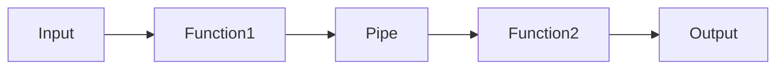

Why is this useful? Without the pipe operator you can wind up writing deeply nested function calls.

<!-- livebook:{"force_markdown":true} -->

```elixir
four.(three.(two.(one.())))
```

But with the pipe operator, you can chain functions together.

<!-- livebook:{"force_markdown":true} -->

```elixir
one.() |> two.() |> three.() |> four.()
```

If a function is called with multiple arguments, the function piped in will be the first argument.

<!-- livebook:{"force_markdown":true} -->

```elixir
two(1, 2) # how to call two/2 by itself.

# How to use the pipe operator
# to call the two/2 with one/1 as the first argument.
one.() |> two.(2)
```

You can also pass in a value to a pipe.

<!-- livebook:{"force_markdown":true} -->

```elixir
1 |> two.()
```

The pipe operator doesn't change the behavior of a program. Instead, the pipe operator
exists as syntax sugar to improve the clarity of your code.

```elixir
add_grapes = fn shopping_list -> shopping_list ++ ["grapes"] end
add_pizza = fn shopping_list -> shopping_list ++ ["pizza"] end
add_blueberries = fn shopping_list -> shopping_list ++ ["blueberries"] end

[]
|> add_grapes.()
|> add_pizza.()
|> add_blueberries.()
|> add_pizza.()
|> add_blueberries.()

# vs the alternative
add_blueberries.(add_pizza.(add_blueberries.(add_pizza.(add_grapes.([])))))
```

## Modules

As you create more and more functions, it becomes necessary to organize them. That's just one of the many reasons to use a **module**. A module is more or less a "bag of functions".

Here's what an empty module looks like.

```elixir
defmodule Hello do
end
```

Again, don't worry about the somewhat strange-looking return value. 
`{:module, Hello, <<70, 79, 82, 49, 0, 0, 4, ...>>, nil}` That's how Elixir represents 
modules internally.

Let's break down what this all means.

1. `defmodule` a keyword that means "define module".
2. `Greeter` is the name of this module. It can be any valid name, and is usually **CapitalCase**.
   you'll often heard the name of the module refered to as the **namespace** that functions are organized under.
3. `do` a keyword that separates the module name and it's internal implementation.
4. `end` a keyword that finishes the module definition.

Modules define functions inside of them. Each function has a name, so they are called **named functions**.
You can define functions inside a module using the following syntax.

```elixir
defmodule Greeter do
  def hello do
    "hello world"
  end
end
```

Let's break down the named function above.

1. `def` this means "define function"
2. `do` a keyword that separates the function head and the function body.
3. `"hello world"` this is the function body. This function returns the string "hello world"
4. `end` is a keyword that ends the function definition.

### Calling a Named Function

To call a function inside a module, you use `Module.function(args)` syntax.

```elixir
Greeter.hello()
```

### Named Functions with parameters

You can create multiple functions in a module.

Here's a new `hi/1` function that says hi to a person.

```elixir
defmodule Greeter do
  def hello do
    "hello world"
  end

  def hi(name) do
    "hi #{name}"
  end
end
```

You call the named function in the module by passing it an argument.

```elixir
Greeter.hi("Brooklin")
```

## Internal Module Functions

A module can use its own functions.

```elixir
defmodule InspectorGadget do
  def gogo(gadget) do
    "Go go gadget #{gadget}!"
  end

  def necktie do
    InspectorGadget.gogo("Necktie")
  end
end

InspectorGadget.necktie()
```

However, you can omit the module name. notice `gogo` instead of `InspectorGadget.gogo`

```elixir
defmodule InspectorGadget do
  def gogo(gadget) do
    "Go go gadget #{gadget}!"
  end

  def necktie do
    gogo("Necktie")
  end
end

InspectorGadget.necktie()
```

## Private Functions

Modules can access other module functions.

```elixir
defmodule Speaker do
  def speak() do
    "hi there"
  end
end

defmodule Listener do
  def listen() do
    "I heard you say: " <> Speaker.speak()
  end
end

Listener.listen()
```

However, sometimes a module must keep a function private for internal use only. Why?
It may be for security reasons or because you don't think it's unnecessary to expose the function to the outside world. 
Often it communicates to other developers how to use your module.

You can create a private module function with `defp` instead of `def`. You'll notice that below the 
`Speaker.think/0` function is undefined to the outside world.

```elixir
defmodule Speaker do
  defp think() do
    "hi there"
  end
end

Speaker.think()
```

We use private functions internally in the module, which means that public functions could expose their values.

```elixir
defmodule Speaker do
  defp think() do
    "hi there"
  end

  def speak() do
    think()
  end
end

Speaker.speak()
```

## Module Attributes

What if you have many functions in a module that all use the same value? You've already learned
that repeating the same hard-coded value over and over again isn't very reusable, and you've
used variables to pass the same value around in your code. However, that's not possible in a module.

Modules and functions in a module close themselves to the outside world. We call this `scope`.
Modules, functions, and many other similar constructs in Elixir are `lexically scoped.

That means that variables defined in one scope cannot be accessed in another scope.

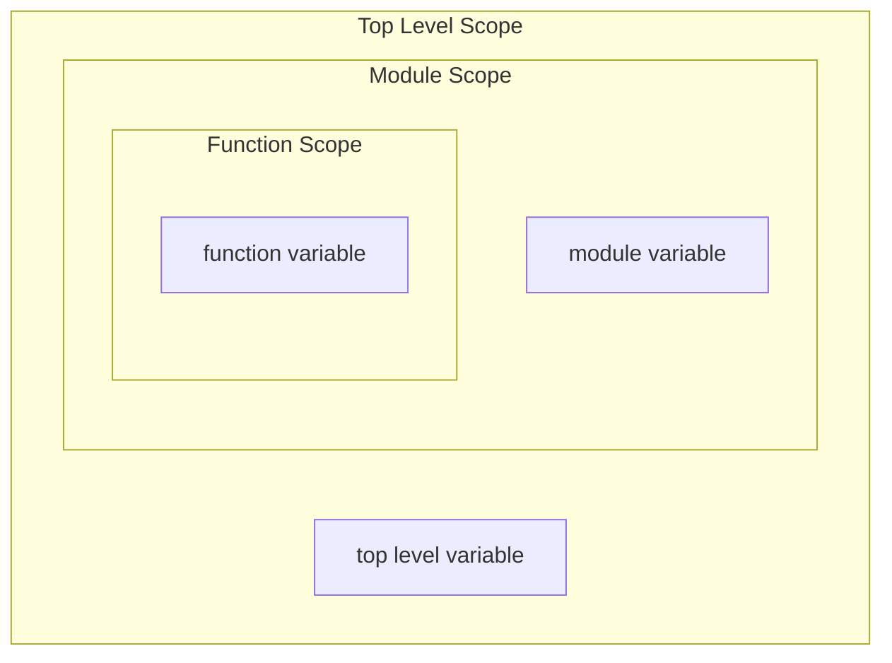

Notice how the following example has an error because we cannot access the variable 
`top_level_scope`

```elixir
top_level_scope = 1

defmodule MyModule do
  def my_function do
    top_level_scope
  end
end
```

The same is true for the module scope.

```elixir
defmodule MyModule do
  module_scope = 2

  def my_function do
    module_scope
  end
end
```

To get around this, Elixir allows you to store constant values as module attributes 
using the `@module_attribute value` syntax. You can then access the `@module_attribue` value in 
any module function.

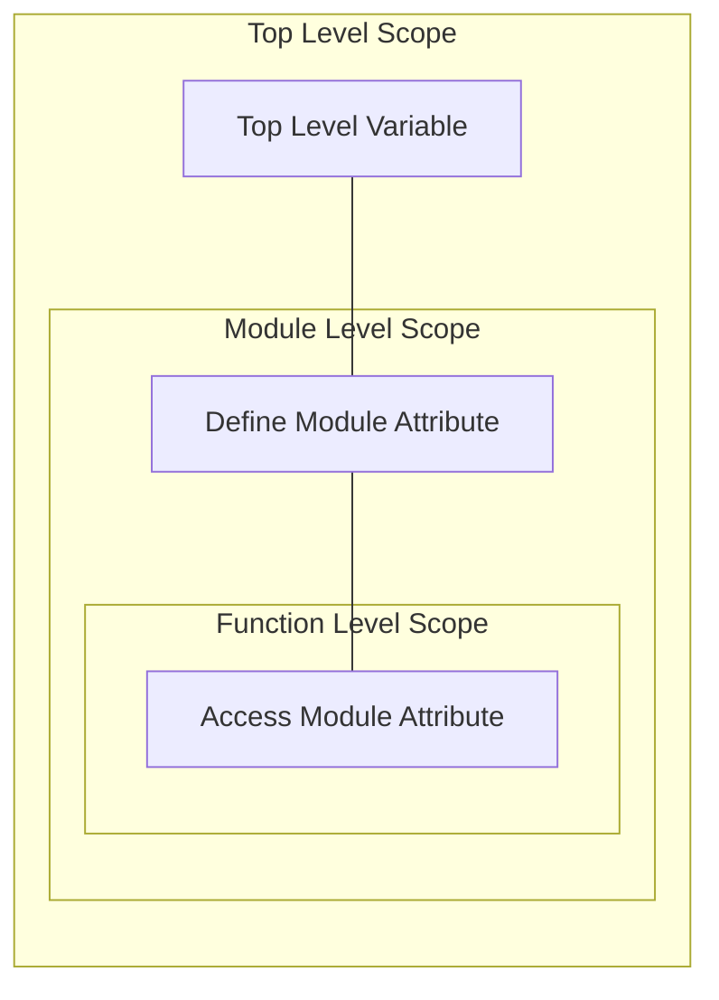

Notice that we can use a module attribute inside of the module's function now.

```elixir
defmodule MyModule do
  @my_attribute "any valid data type"
  def my_function do
    @my_attribute
  end
end

MyModule.my_function()
```

We can also access a variable in the top-level scope as long as we set a module attribute.

```elixir
top_level_variable = 1

defmodule MyModule do
  @my_attribute top_level_variable
  def my_function do
    @my_attribute
  end
end

MyModule.my_function()
```

Now we can easily share constant values between multiple module functions.

```elixir
defmodule Hero do
  @name "Batman"
  @nemesis "Joker"

  def catchphrase do
    "I am #{@name}."
  end

  def victory do
    "I #{@name} will defeat you #{@nemesis}!"
  end
end

Hero.victory()
```

If the module attribute value changes, you only need to change the module attribute.

```elixir
defmodule Hero do
  @name "IronMan"
  @nemesis "Mandarin"

  def catchphrase do
    "I am #{@name}."
  end

  def victory do
    "I #{@name} will defeat you #{@nemesis}!"
  end
end

Hero.victory()
```

## Multiple Function Clauses

Elixir allows us to define multiple functions with the same name but that expect different parameters.
This means the function has multiple function clauses.
For example, we can take our `hi` function and create a new version that says hi to two people.

```elixir
defmodule Greeter do
  def hi(name1, name2) do
    "hi #{name1}, hi #{name2}"
  end

  def hi(name) do
    "hi #{name}"
  end
end

Greeter.hi("Peter Parker", "Mary Jane")
```

In the example above, each function has a different **arity**. You can treat each function with
a different arity as a different function. We often refer to each function by its arity
as function/arity.

So the `Greeter` module has a  `hi/1` (hi one) function and `hi/2` (hi two) function.

## Polymorphism

The word polymorphism comes from the Greek word for "many shapes".
It means essentially the same thing for our programs.
We often want to define a single general behavior, but apply it to different things.

In the example above, we use multiple function clauses to achieve polymophism using the same
generic `hi` function to say hi to one person, or two people. Earlier, we also achieved polymorphism 
with the `call_twice` function, which abstracts a generic repeatable behavior, but does not
care about the specific function that it's calling twice.

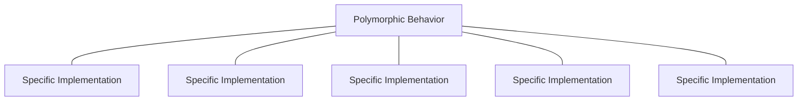

Running is a great real-world example of polymorphism. Many different animals run,
and they all run in different ways.

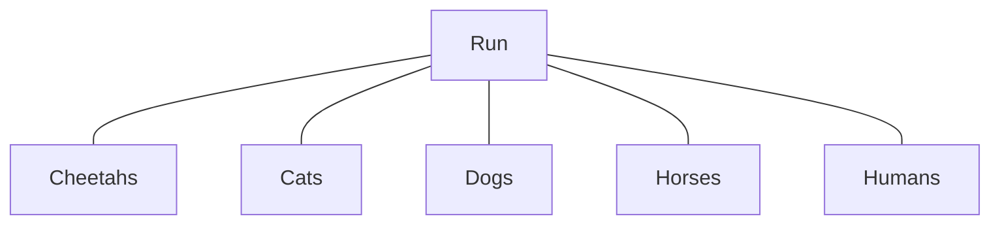

# Structs, Built-In Modules, Behaviors, and Protocols

## Setup

```elixir
require Integer
```

## Overview

Have you ever heard the expression "Reinventing the wheel?". Essentially it means repeating
a useless action or solving an already solved problem.

In programming, it's important to avoid reinventing the wheel, and instead rely on previously
existing solutions. Sometimes those previously existing solutions are our own!

In the previous lesson you learned about how to use modules and functions in order to 
abstract away generic and reusable behavior.

We also talked about polymorphism. Polymorphic code maintains consistent behavior while changing
the underlaying implementation.

In this lesson, you'll learn about more constructs and built-in tools Elixir provides to enable
reusable code and polymorphic code.

In this lesson we'll talk about:

* Custom reusable data structures with **Structs**.
* Reusable pre-built functionality with **Built-In Elixir Modules**.
* Polymorphic code with **Behaviours**.
* Polymorphic code with **Protocols**.


